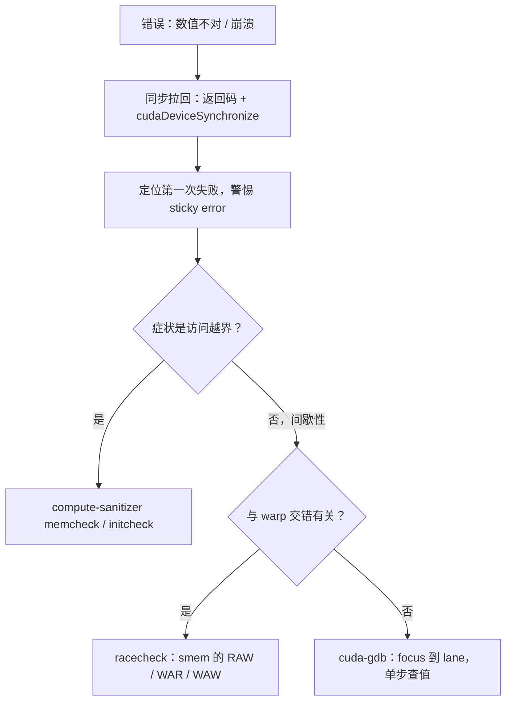

# GPU 调试

CPU 调试者信两件事：断点会停在原处，错误会立刻抛出；GPU 把两件都收走了——调试的第一步是承认这一点。

<footer>—— 据 CUDA 工具链文档（cuda-gdb、compute-sanitizer）整理</footer>

[上一课](/cs/gpu-profiling)把「慢」变成了证据；本课处理「错」。缺口的形态很具体：kernel 报错在几步之后才浮出、竞态只在特定 warp 交错时出现、printf 的顺序毫无意义——host 侧调试直觉在这三条上全部失灵。方法侧同样三条：cuda-gdb 的 warp 级视角、printf 的真实语义、compute-sanitizer 四件套。工具的名字不重要，重要的是每件工具对应哪一类「失灵」。

## 问题

三条失灵各有机制。第一，launch 是异步的（第一课的合同）：非法访存的错误码要等以后某次同步才返回，此时出错现场早已散场，栈不可追。第二，smem 没有一致性协议兜底（第四课的端口账）：CPU 上没出现竞态的代码搬到 GPU 上会出，因为缓存一致性协议在 CPU 上悄悄排掉了大部分交错——GPU 上没有这个兜底，交错落谁家由调度顺序决定。第三，数千线程共享一个输出流，「printf 顺序」四个字没有定义。不承认这三条的调试，通常是改一版、跑一遍、碰运气。

## 方法

错误传播的纪律先立起来：每个运行时 API 调用后查返回码；kernel 之后用 `cudaGetLastError` 加 `cudaDeviceSynchronize` 把异步错误拉回调用点。注意 sticky error：一次非法访存之后整个上下文带病，后续调用连环失败，报错位置与真实现场相距甚远——先把「第一次失败」找出来，必要时 `cudaDeviceReset` 清场重来。cuda-gdb 的视角是 warp 级：断点打到 kernel 行，`focus` 在 thread、warp、lane 之间切换，看的是单个 lane 的寄存器与变量；「切换 focus」这个动作本身就是 SIMT 语义的调试版——同一断点上 32 个 lane 一起停，各自的状态分别可查。printf 的语义要背下来：每线程一条缓冲，kernel 结束或显式 flush 时统一吐出——它当示波器用（确认某 lane 某时刻的值），不当日志用（顺序与完备性都没有承诺）。

## 机制

sanitizer 为什么必须独立成工具：竞态检测要看见「所有可能的交错」，而调度顺序不可复现，唯一可靠的办法是插桩执行——把每次 smem 访问记录下来，按读写序找 hazard。racecheck 报告分 RAW、WAR、WAW 三类，对着屏障语义读：WAR 多半是双缓冲少了第二道屏障，上一轮的读还没完就被下一轮的写覆盖；这类错误 profile 完全看不见，因为结果是「有时对」。四件套各管一摊：memcheck 查全局越界与对齐、initcheck 查未初始化读、synccheck 查屏障误用（发散调用、配对缺失）。代价是插桩减速一到两个数量级——定位用它，回归测试别全量跑，挑风险内核定时跑。

确定性是复现的前提：warp 调度顺序无承诺，把随机种子、launch 配置、输入数据钉死，缩小到能触发问题的最小形状，竞态才有得治。驱动层的崩溃另有体系：Xid 编码表把 GPU 侧异常分类（非法访存、ECC、掉卡），先查表再猜——驱动报的错误码比应用程序的二次转述可信。

## 边界

多 GPU 一致性与 NVLink 级问题、驱动与固件的深水区，不在本课——那要系统层的取证。性能问题回上一课的 profiler，别拿 sanitizer 找慢：插桩本身改变时序，测出来的「性能」没有意义。printf 与断点都有观察者效应（串行化、重排），确认问题存在之后，定位要靠 sanitizer 的插桩证据，而不是更多打印。最后，调试纪律的尽头是少调试：把布局合同（第五课的 lane 映射表）写成断言、把同步配对写成 RAII 封装，让错误在编译期和第一次运行就现形。

racecheck 的易错点：它只查 smem，不查全局内存——全局的竞态要靠原子与内存序（acquire-release 那套合同）自证，工具只能提示可疑访问对。两类存储、两套检查手段，别混着期待。

## 小结

- 异步 launch 与 sticky error 决定错误传播纪律：每个调用点查码，同步拉回，先找第一次失败。
- smem 无一致性兜底，竞态按交错随机出现；复现先钉死种子、配置与输入。
- printf 是示波器不是日志：缓冲统一吐出，顺序无承诺。
- compute-sanitizer 四件套对四类病：memcheck、racecheck、initcheck、synccheck；插桩减速一到两个量级。
- racecheck 只管 smem；全局内存的竞态归原子与内存序。
- 出处：NVIDIA CUDA 工具链文档（cuda-gdb、compute-sanitizer）与驱动 Xid 编码表。
