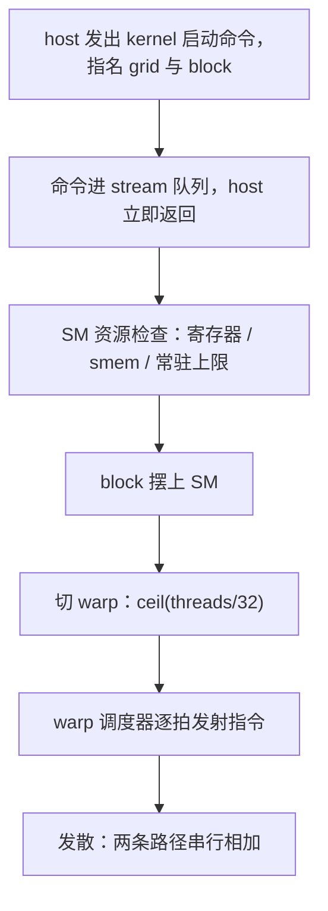
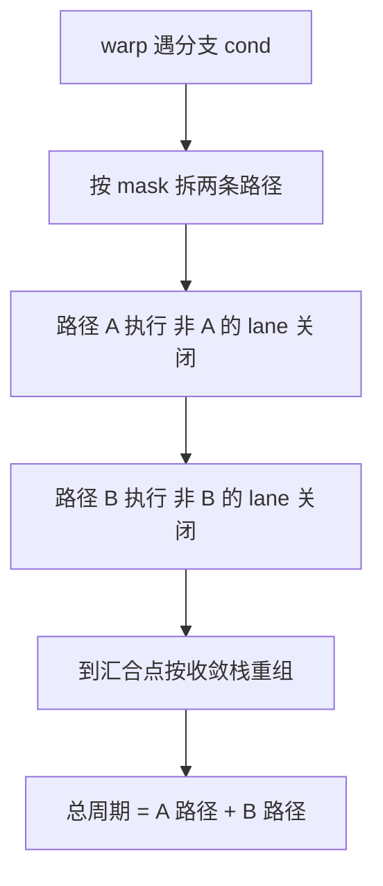

# CUDA 执行模型的深入

线程是你写的语法，warp 才是硬件执行的语法；两套语法之间的翻译合同，就是 GPU 编程的第一笔税。

<footer>—— 据 NVIDIA CUDA C++ Programming Guide「Hardware Implementation」章与 Lindholm et al., IEEE Micro, 2008 整理</footer>

[上一课](/cs/formal-verification-sel4)把安全进阶封了口：细化把规格接到 C，假设之外仍是工程；密码、利用与系统防御一族到此收束。本课是「GPU 编程深入」的第一课，转向另一端的机器。本栏主干已经给过两块底子：[SIMT](/cs/gpu-simt) 讲了 warp 共享 PC、切 warp 藏延迟的画面，[存储层次](/cs/gpu-memory-hierarchy)给了从寄存器到 HBM 的鸟瞰；大模型栏的 [Warp / CTA / 占用率](/llm/cuda-occupancy)又从写内核的角度算过占用率的账。缺的是执行模型本身的合同：`kernel<<<grid, block>>>` 发出之后，硬件如何把线程折成 warp、把 warp 摆上 SM、按什么规则发射指令。后课的层次、原语、张量核都默认你已经读完本课。

## 问题

主干给的是画面，不是账。同一份核函数，block 尺寸从 64 改到 256，速度差三倍；换一台同代显卡，最优尺寸又不一样。如果只把 block 当「随便填的并行度」，每个尺寸选择都是抽签。缺口因此是：把「线程是虚构的、warp 是实体的」这条 SIMT 直觉，补成一张能预算的表——block 怎么被切分、凭什么被放上某个 SM、放上去之后每一拍发生什么。大模型栏的占用率课给过「怎么算占用率」，本课给的是占用率公式的来路：每一项除数都是一条硬件限制。

### 从三层命名到调度原子

grid、block、thread 是程序员的命名；硬件接手的是 block（CTA）。launch 之后，运行时把 block 逐个分给 SM，每个 SM 收一个 block 之前先过资源检查：该 block 每线程的寄存器数乘以线程数不超过 SM 寄存器堆，静态 smem 请求不超过片上余量，常驻线程数不超过上限。检查不过，block 就排队等别的退场。block 内部随即切成 $n=\lceil \mathrm{blockDim}/32\rceil$ 个 warp——不够 32 的零头也占一个 warp，这就是「block 尺寸取 32 的倍数」的由来：零头 warp 里的 lane 空转，白占一个调度名额。

## 方法

把资源检查写成预算表，写核之前先估三行。寄存器：A100（sm_80）每 SM 65536 个 32 位寄存器，每线程上限 255；若编译器报 128 个每线程，仅此一项就把常驻压到 512 线程。smem：静态加动态请求一起报。线程上限：sm_80 每 SM 2048。三行取最小，就是该 block 能驻留的份数，也是占用率课里那个公式的除数来源。编译走两级：`.cu` 先编到 PTX 这个虚拟指令集，驱动再把 PTX 或内嵌的 SASS 装到具体芯片——所以老二进制在新卡上仍能跑（驱动现场编译），但首次启动要付 JIT 的钱。

launch 的异步语义要当成合同背下来：命令进入 stream 队列后 host 立即返回，错误码也要等到以后某次同步才浮出——这既是性能设计，也是调试课里一切麻烦的源头。

## 机制

发射的账在调度器上。A100 每个 SM 有四个 warp 调度器，每拍各可发射一条指令；一个 warp 因访存停住时，调度器切到同组的其他 warp。延迟隐藏因此不是魔法，是乘法：常驻 warp 数乘以每 warp 的发射率，要盖得住访存延迟乘访存频度——常驻不够时，盖不住的等待直接变成空拍，这正是占用率检查在执行期的意义。

Volta 起的独立线程调度把锁步拆掉了：每个 lane 有自己的 PC，配一套收敛栈；发散的分支里，跑完一条路径再跑另一条，落汇合点按栈重组。变化在语义而不在成本：发散的成本从「锁步被破坏」变成「两条路径的周期相加」，$t_{\mathrm{warp}} = t_{\mathrm{taken}} + t_{\mathrm{skipped}}$。写代码的推论是：分支两侧的长调用照样贵，warp 内「多数投票再统一走」这类技巧（第三课）才有价值。

A100 的账：65536 个寄存器除以每线程 128 个，常驻上限先被压到 512 线程——寄存器密度常常比占用率计算器更早给出瓶颈；`-Xptxas -v` 的编译输出就是这张表的第一行。

数字实例：block 取 100 线程，$\lceil 100/32\rceil=4$ 个 warp，第 4 个 warp 只有 4 条活跃 lane——28/32 ≈ 88% 的算力白占调度名额还照付发射周期；取 96 或 128 则整除无零头。同一份核函数仅把 block 从 64 调到 256 就差三倍，正是因为 warp 数与常驻份数一起变了。

常见误区：初学者容易以为「if 分支里另一个 warp 的线程也在并行跑」。实际上分支把同一个 warp 的 32 条 lane 拆成两组先后执行，硬件用 mask 关掉不参与的 lane；只有不同 warp 之间才是真并行。所以「if 里做慢调用不影响别的线程」在 warp 内不成立。

## 边界

本课不讲数据放在哪一层——那是下一课；不进张量核的指令合同——第五课起。占用率高不等于快，[占用率课](/llm/cuda-occupancy)已立过这条，本课只补了它的来路。执行模型不承诺任何 warp 间时序：同一 block 内 warp 的推进顺序无定义，任何跨 warp 的协作必须显式同步；拿「通常先启动的先跑」当代价模型，会在换卡或换驱动时变成竞态。也不承诺指令的精确周期数——本课的账是量级与结构，不是时钟级仿真；要证据，profiling 课会给。

## 小结

- grid/block/thread 是命名，CTA 是调度与占用的原子；block 上 SM 前过寄存器、smem、常驻上限三道检查。
- block 切成 $\lceil \mathrm{threads}/32\rceil$ 个 warp，零头也占一个 warp——block 尺寸取 32 的倍数。
- 延迟隐藏是乘法账：常驻 warp 数乘发射率盖住访存等待，盖不住就是空拍。
- Volta 起独立线程调度：每 lane 一份 PC，发散成本是两条路径相加，语义合同落在 mask 参数上。
- launch 异步、错误延迟浮出、PTX 到 SASS 两级编译，都是后课反复用到的合同。
- 出处：NVIDIA CUDA C++ Programming Guide「Hardware Implementation」章；Lindholm et al., *IEEE Micro*, 2008。
