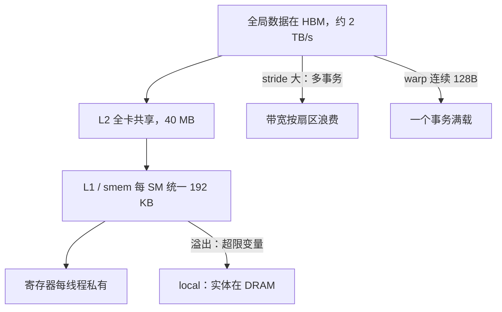

# 内存层次的实践

GPU 的快不是算得快，而是字节恰好停在你正在算的那一层；放错一层的每个字节，都在为带宽排队。

<footer>—— 据 Kirk &amp; Hwu, Programming Massively Parallel Processors；NVIDIA CUDA C++ Programming Guide 整理</footer>

[上一课](/cs/gpu-execution-model-deep)把执行合同算到了 warp 调度：延迟隐藏盖得住等待，盖不住没数据可算。一个 warp 停在 long scoreboard 上，等的是哪一层的字节回来，由数据放在哪层决定。本栏的[存储层次鸟瞰](/cs/gpu-memory-hierarchy)给过层次图，[DRAM 时序](/cs/dram-timing)给过行命中与冲突的账；大模型栏的[内存访问模式分析](/llm/ak-memory-access)在注意力内核上算过访存账。本课把这套账写成日常实践：每层的容量与带宽、合并访问的判据、以及「这个数该放哪」的决策规则。

## 问题

[roofline](/cs/roofline-model) 里的 $B$ 到底取哪一层，取决于你把数据钉在哪——算强度的分母随层次变，而初学者几乎总把 HBM 带宽代入，于是把「smem 上的复用没做够」误诊成「带宽墙」。缺口是从层次图到数字的那一步：寄存器、local、shared、L1、L2、HBM 各层的容量与带宽差多少倍，一条全局加载指令在什么条件下折叠成一个事务。没有这张表，优化就是在错误的层上找带宽。

## 方法

逐层立账（A100 量级）：寄存器每线程私有，访问零等待；超出的变量溢出到 local——名字里有 local，实体在 DRAM，走 L1/L2，这就是溢出比看起来贵得多的原因。shared 是片上 SRAM，与 L1 共用同一块 192 KB 的存储，smem 最多划走 164 KB，分账比例是启动配置。L2 全卡共享，40 MB 量级，是跨 SM 的汇合点。HBM 峰值约 2 TB/s（SXM 型号），容量最大、最远。相邻层的带宽差一到几个数量级：把一个被反复读的量从 HBM 挪进 smem，等价于把它的价格降两个量级。

合并访问是全局访存的判据：warp 的 32 个地址若落在连续的 128 字节里，硬件折叠成一个事务；地址分散则拆成多个事务，每个事务只用到一部分扇区。判据写代码时就能检查——同一 warp 的第 $i$ 个线程访问 $\mathrm{base}+i\cdot s$：$s=1$ 的 float 数组满宽利用；$s=2$ 有效带宽减半；$s$ 大到每线程独占一个 32 字节扇区时，取回 1024 字节只用 128 字节。`__restrict__` 与只读声明让编译器敢于走只读通路、省一次 L1 一致性顾虑。

## 机制

合并为什么有效，要接回 [DRAM 时序](/cs/dram-timing)：缓存行与扇区是 DRAM 突发长度的镜像，一次请求无论用不用满，行缓冲都按同样粒度服务——分散访问让行缓冲反复换行，把行命中的账换成行冲突的账。smem 与 L1 分账的设计动机也在这：两块用途（程序管理的复用对硬件管理的缓存）对容量与延迟的要求不同，但 SRAM 面积是硬预算，硬件让软件来划这条线——所以 smem 配置是核函数的属性，不是编译期常量。

放数决策因此有一条固定顺序：先问复用（跨线程共享的量进 smem，warp 内共享的量下一课有更窄的通道），再问合并（全局访问的 stride 与对齐），最后才谈占用率——寄存器用量与占用率的联动在[占用率课](/llm/cuda-occupancy)已经算过，本课只提醒一句：为降占用率而省寄存器，省出来的往往是溢出到 local 的流量，账平不了。

## 边界

bank 冲突留给下一课——smem 的并行度还剩最后一条账。张量核的喂料路径（smem 布局与碎片对齐）是第五课的合同。本课的数字随代际漂移：L2 多大、HBM 几代，每两年一换；漂移的是数字，不漂移的是相邻层一至两个量级的价差与「先复用、再合并、后占用」的顺序。跨 SM 的数据流（peer 直访、NVLink）不在本课，那是多卡系统的题。

一次真实的误诊：核函数 L2 命中率不低、DRAM 吞吐却顶满——查出来是一个中间张量每步从 HBM 重读，而它的复用半径只有一个 block。挪进 smem 后 DRAM 吞吐降一半，核反而快了：省下来的带宽让别的 warp 不用等。

## 小结

- 层次账先于代码：寄存器零等待、smem/L1 片上 192 KB、L2 40 MB、HBM 约 2 TB/s，相邻层差量级。
- 溢出的 local 名字骗人：实体在 DRAM，寄存器压力最后都变成带宽账。
- 合并判据看 warp 的地址分布：连续 128 字节一个事务；stride 每大一步，扇区利用率按比例掉。
- smem 与 L1 同一块 SRAM，分账是启动配置——划多少是核函数的决策。
- 决策顺序固定：复用、合并、占用率；顺序反了会在错误的层上找带宽。
- 出处：Kirk &amp; Hwu, *Programming Massively Parallel Processors*；NVIDIA CUDA C++ Programming Guide 内存层次章；Hennessy and Patterson, *CA:AQA*。
