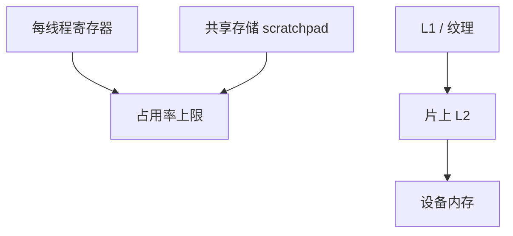

# GPU 存储层次

寄存器、共享存储、L1/L2、HBM 的容量与延迟差几个数量级；SIMT 用占用率换延迟隐藏，但带宽仍要程序把访问打到对的那一层。

<footer>—— 据 NVIDIA CUDA 编程指南中的硬件模型；Lindholm et al., IEEE Micro 2008；Hennessy and Patterson, CA:AQA 整理</footer>

[上一课](/cs/gpu-simt) 用切 warp 藏延迟，没说数据住哪。CPU 的 [局部性](/cs/locality-principle) 与 [MESI](/cs/mesi-protocol) 不能原样搬来：GPU 的「共享存储」是程序员可见的暂存，一致性模型更弱。本课不重讲 warp 调度。缺口是**层次：寄存器堆、scratchpad、cache、设备内存，以及它们如何限制占用率。**

## 问题

HBM 带宽高、延迟仍几十到上百 ns。若每个线程每次运算都打 HBM，切 warp 也不够。缺口不是再加 CPU 式的 8 路 L1，而是**把热数据放进每 SM 的共享存储或寄存器，cache 当作自动的那一层，并承认寄存器文件大小直接限制驻留 warp 数。**

共享存储（scratchpad）按 bank 组织，冲突会串行化——下一课合并与本课 bank 是带宽的两面。L2 常片上共享，跨 SM 的原子在这里汇合。

## 方法

编译器把私有变量放寄存器；程序员或编译器把协作缓冲放 shared；其余走全局内存，硬件 cache 可选。占用率：每个 warp 的寄存器数 × warp 数 ≤ 物理堆；shared 用量同样设上限。原子与栅栏在 SM 内走共享存储或 L1；跨 SM 走 L2。

## 机制

与 CPU：[VIPT](/cs/vipt-cache) 仍可能出现在 I-cache/D-cache，但 GPU 更强调带宽而非单线程命中延迟。一致性：许多 GPU 对全局内存提供较弱保证，需要显式栅栏与内存空间限定——对应 CPU 的 [fence](/cs/fence-cost)，但粒度是 warp/block。不要把这里写成训练用的 HBM 容量规划；本课只给硬件层次。

占用率与延迟隐藏是一对：驻留 warp 太少，一次 shared miss 就露馅；寄存器分配过狠则驻留掉下去。编译器报告的 occupancy 是这一层的可读接口，不是 ISA。

## 边界

本课不把每代芯片的 KiB 数当考试。分支发散下一课会让部分 lane 关掉，有效带宽再打折。合并访存再下一课：全局 load 如何合成少量事务。

后课默认：寄存器与 shared 决定能藏多少延迟。控制流不一致会让一部分 lane 空转。

## 小结

- GPU 层次是寄存器 / scratchpad / cache / HBM；占用率绑在前两层。
- 切 warp 藏延迟，带宽仍靠数据放对层。
- 分支让共享 PC 破裂，下一课发散。
- 出处：Lindholm et al.；CUDA 硬件模型；Hennessy and Patterson, *CA:AQA*。
