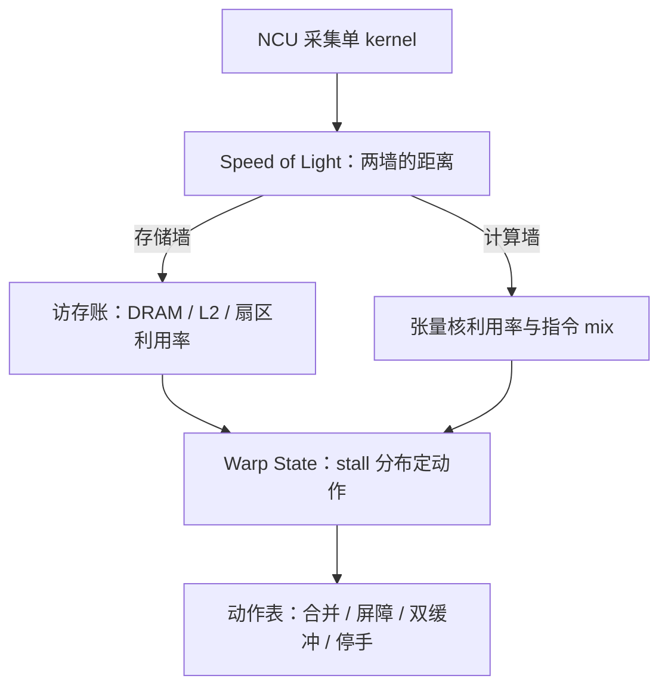

# 性能计数与 profiling

<div class="epigraph">
<p>profile 不回答「慢不慢」，回答「慢在哪一层」；把猜测的树剪成有证据的一条路，是计数器唯一的用途。</p>
<footer>—— 据 Nsight Compute 文档；Williams, Waterman and Patterson, CACM, 2009（roofline）整理</footer>
</div>

[上一课](/cs/gpu-cutlass-intuition)给了「应该快」的模型：前六课都是先算账再写码。缺口反过来——内核已经在跑，账却对不上：带宽没到屋顶、占用率够却不快、张量核利用率个位数。本栏的 [roofline](/cs/roofline-model) 给过强度与两面墙的框架；大模型栏的[内核基准测试方法论](/llm/ak-benchmark-methodology)定了计时与比较的规矩，[Warp / CTA / 占用率](/llm/cuda-occupancy)说过以 NCU 的实现占用与 stall 原因为准。本课写 Nsight Compute 的计数器体系：从指标读数到诊断动作的固定路径。

## 问题

「慢」的原因是一棵树：算强度低？合并没有做？bank 冲突？流水没叠上？喂料断了？靠猜加试，每层两个候选就是指数级的组合。更麻烦的是直觉在这台机器上系统性失灵——第一课到第五课的每笔账都可能同时出错，人脑排不出优先级。缺口是把「为什么慢」从开放式猜测变成一次读数：哪几个计数器先看、读数怎么翻译成动作、什么时候该怀疑读数本身。

## 方法

NCU 的三段读法有固定顺序。第一段 Speed of Light：计算与存储各自达到峰值的百分比——两个数字直接告诉你靠哪面墙，是 roofline 的运行时形态。<span class="marginnote">Speed of Light（光速）是 profiler 界的行话，不是物理光速：它把内核耗时和「理论最理想值」做比，得到还能快多少的百分比，相当于每次 profile 先免费送你一张 roofline 图。</span>第二段 Memory Workload Analysis 对访存的账：DRAM 吞吐、L2 命中率、扇区利用率——最后一项正是第二课合并判据的运行时读数，低于八成先查 stride。<span class="marginnote">扇区是显存读写的最小单位，一个 32 字节。数字实例：一个 warp 读 32 个连续 float 共 128 字节，正好凑满 4 个扇区，利用率 100%；若 32 个线程各跳到 4 KB 开外的地址，同样 128 字节有效数据要动用 32 个扇区，利用率跌到 12.5%——带宽有七成八白白搬了用不上的字节。</span>第三段 Warp State Statistics 看 stall 分布：long scoreboard 排头是访存依赖（查合并与层次），barrier 排头是同步等待（查发散的 `__syncthreads` 与双缓冲配对），wait 排头是定长指令依赖（查 ILP），not selected 排头说明调度器饱和——这时加占用率无用。计时本身沿用[基准方法论](/llm/ak-benchmark-methodology)的规矩：锁频、冲 L2、warmup 后取分布而非单值，`cudaEvent` 或 NVTX 圈段。



## 机制

读数从哪来，决定它可信到什么程度。SM 内有硬件计数单元：每个调度器记发射与活跃，访存单元记事务与扇区；stall 原因靠周期采样归因——在每个发射口记下「此刻 warp 为什么没发」，聚合成分布。所以 stall 表是统计近似，不是逐指令事实：读数与账本冲突时，先怀疑采样窗口与归因口径，再怀疑账本。<span class="marginnote">「重放」是 NCU 出数的底层手段：计数器硬件数量有限，一次采集装不下所有指标，profiler 就把同一个内核反复执行几十遍、每遍换一组计数器，最后拼成一份报告。所以它必须自己锁频、控缓存才能保证几十遍跑的是「同一种慢」，这也是它的数字不能当线上延迟的根因。</span>

```mermaid
flowchart LR
  SM["SM 硬件计数单元"] -->|"调度器逐周期记"| ISS["发射 / 活跃计数"]
  SM -->|"访存单元记事务"| TXN["事务与扇区计数"]
  SM -->|"发射口周期采样"| STALL["stall 原因样本"]
  STALL --> AGG["聚合为 stall 分布"]
  ISS --> REP["拼合成 NCU 报告"]
  TXN --> REP
  AGG --> REP
  REP --> CHK["与理论账本对账"]
  CHK -->|"读数冲突"| FIX["先疑采样窗口与口径"]
  CHK -->|"读数一致"| ACT["按动作表执行"]
```SOL 百分比的分母是理论峰值（锁频下的），所以「离屋顶多远」跨机器可比，绝对微秒数不可比——这与基准课「比较条件先对齐」是同一条纪律。

读数翻成动作要按表走，不按兴趣走：扇区利用率低才动数据布局；long scoreboard 高才查合并；barrier 高才查同步结构；not selected 高就停手——那是调度饱和的信号，继续「优化」只会把代码改复杂。每一步动作之后重跑 NCU 对账：目标是把主导 stall 换人，而不是把某个百分比刷满。

## 边界

profiler 有观察者效应：NCU 会重放内核、可能序列化、要锁频——它回答结构问题，不给出产环境的延迟数字；后者归 Nsight Systems 的时间线（kernel 间隔、拷贝重叠、多进程争用）。单 kernel 深潜与系统视图是互补的两种采集，别拿 NCU 的微秒去和线上 p99 比。计数器语义随代际增删（新架构加新单元），跨卡比较读数前先对文档。最后一条边界是组织性的：没有基准网格（形状、批次、精度）的 profile 报告无法复现——采集脚本与配置进版本库，和代码同权。

<span class="marginnote">「not selected 高就停手」最反直觉：它是唯一一个 stall 排头意味着性能已经到顶的情况——warp 随时待发、调度器没有空拍，剩下的差距在算法或屋顶本身，微调内核只是烧时间。</span>

## 小结

- 三段读法固定顺序：SOL 定墙、访存账对数、stall 分布定动作。
- 扇区利用率是合并判据的运行时读数；stall 表要翻成动作表，按表走不按直觉走。
- not selected 排头等于调度饱和：停手信号，不是优化邀请。
- stall 是周期采样归因，统计近似；读数与账本冲突先查口径。
- NCU 答结构、Nsight Systems 答系统；观察者效应使 NCU 数字不能当线上延迟。
- 出处：NVIDIA Nsight Compute 文档；Williams, Waterman, Patterson, *CACM*, 2009。
