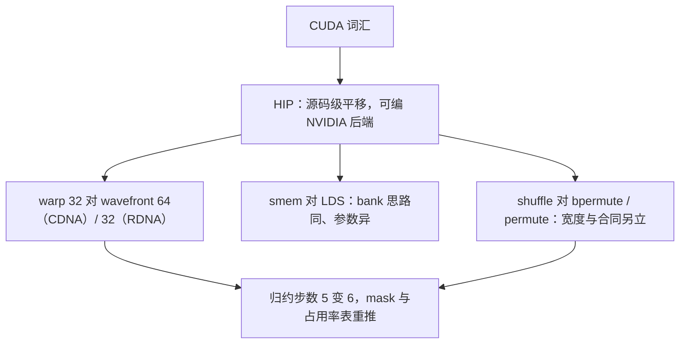
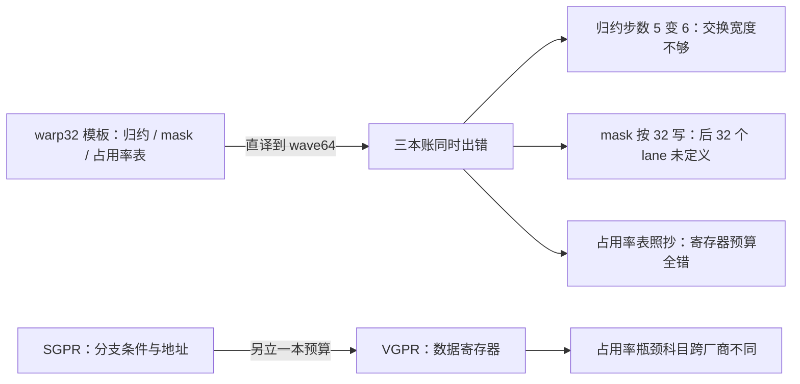

# ROCm 的对照

把 CUDA 的词汇逐条换成 ROCm 的对应物，剩下的不变量才是并行计算本身；翻译失败的地方，就是你原来依赖了厂商细节的地方。

<footer>—— 据 AMD ROCm 与 HIP 文档整理</footer>

[上一课](/cs/gpu-debugging)收了 NVIDIA 侧的工具链；本课换一家厂商做对照。前九课的词汇——CUDA、warp、smem、PTX——都是专名；AMD 的 ROCm 栈提供一套完整的平行词汇，大模型栏的[多后端移植](/llm/ak-multi-backend)已经在内核工程里做过这种翻译。本课把翻译表本身当作课：哪些概念一一对应，哪些对应物尺寸不同、从而一切推论要重算。

## 问题

迁移成本不均匀地分布在三层。语言层最浅：HIP 与 CUDA 几乎一一对应，`hipify` 工具能机械翻译大部分源码，同一份 HIP 甚至可选 NVIDIA 后端编译——它更像可移植层而不是另一套方言。初学者容易以为「hipify 跑完、编译通过就算移植完了」：`cudaMalloc` 换成 `hipMalloc` 这类改名确实能机械完成，但那只占工作量的一小成——真正的大头在内核层重推 warp 假设、跑数值与性能验证，编译通过只是起跑线。库层居中：rocBLAS、hipBLASLt 对 cuBLAS，MIOpen 对 cuDNN，接口平移，调优深度与覆盖面有差。内核层最深，也最容易被低估：所有按「warp 等于 32」写下的假设——shuffle 归约、butterfly 表、占用率账、bank 映射——要全部重推。缺的是一张判据明确的翻译表：哪条翻译是无损的，哪条翻译之后数字要换。

## 方法

对照表逐行过。thread block 对 workgroup，`__syncthreads` 对 barrier，语义同名同义；shared memory 对 LDS（Local Data Share），端口与分账的思路同、参数不同。LDS 就是 AMD 给 shared memory 起的名字：同样是每个 workgroup 一块的片上暂存区。可以把它想象成同一间储物间换了块门牌——储物规则（bank 分账）思路还在，但柜子数量和开门方式要重新查表，照抄 bank 账会踩坑。warp 对 wavefront——这是最大的一处：CDNA（Instinct 卡）64 lane，RDNA 32 lane，今天的 MI300X 是 CDNA3，走 64。shuffle 对 bpermute / permute 一类指令，走 LDS 实现或专用交换，宽度与语义都与 `__shfl_sync` 不同，mask 合同另立。指令层：PTX 对 AMDGCN ISA，同样有中间表示到芯片指令的两级。寄存器文件多出一层：标量单元的 SGPR 管控制流与地址，向量单元的 VGPR 管数据——GCN/CDNA 把两条通路分开，wave 内分支粒度是整条 wave，与 [SIMT](/cs/gpu-simt) 的共享 PC 同一家族。工具链平行物齐全：rocm-smi、rocprof、Omniperf 对 nvidia-smi 与 NCU，ROCgdb 对 cuda-gdb。

## 机制

wave64 为什么是一切的分水岭：第三课的 butterfly 归约步数从 $\log_2 32 = 5$ 变成 $\log_2 64 = 6$，交换宽度、掩码约定、占用率的上限与下限全部联动——用 warp32 假设写的模板直译过去，轻则慢一半，重则后 32 个 lane 拿未定义值。这不只是 API 差异，是调度原子的尺寸变了，第一课「线程折成 warp」的折法随之改变。SGPR/VGPR 分离的推论也值得记：寄存器压力账要分两本，控制流的自燃依赖（分支条件、地址算术）走标量单元后，向量寄存器的预算可以留给数据——同一份核在两家上的占用率瓶颈常在不同科目上。SGPR 与 VGPR 的分工可以想象成餐厅：SGPR 是贴在墙上的固定告示（菜价、桌号——全 wave 一致的控制流和地址，一份就够），VGPR 是每桌客人自己点的菜单（数据，每个 lane 一份）。告示不占菜单的钱，所以寄存器预算要分两本记，占用率账才能算对。

对照的真正收益在方法论检验：本课程九笔账——资源检查、层次价格、warp 通道、bank 序、碎片合同、分层库、计数器、竞态工具——在 ROCm 上全部有对应物，只有参数换。这印证了收束课要立的论点：账本结构是本质，账本数字是专名。移植的验收也照旧：先跑竞态与越界检查，再对数值，最后才比性能（[基准方法论](/llm/ak-benchmark-methodology)的规矩在两家同样适用）。

## 边界

本课不做性能裁决：两家每代互有胜负，数字随驱动与形状漂移，引用谁的基准都要带日期与版本。Intel 的 oneAPI 与 SYCL 是第三套词汇，本课不展开；具体指令编码归各家 ISA 手册（CDNA 系列的 ISA 参考是公开的）。HIP 的覆盖也有边界：最新的图形与视频栈、部分专有库没有对等物——翻译表上「查无此行」的地方，就是方案选型的风险位，要在迁移前标注而不是迁移中撞上。

一个典型移植坑：`__shfl_xor_sync(..., 32)` 的宽度常量直译后在 wave64 上只覆盖半个 wave，其余 lane 的返回值未定义——编译器不报错、结果「大体对」。移植后的第一件事是跑 sanitizer 类检查，第二件事才是看数值。

## 小结

- 迁移成本分三层：HIP 源码平移最浅，库接口居中，内核层的 warp 假设最深。
- wavefront 尺寸是分水岭：CDNA 64、RDNA 32；归约步数、mask、占用率表全部联动重推。
- SGPR/VGPR 分离让寄存器压力分两本账，占用率瓶颈科目可能与 NVIDIA 不同。
- 翻译表「查无此行」处是选型风险位，迁移前标注。
- 账本结构跨厂商不变、参数是专名——这是本课程方法可移植性的检验。
- 出处：AMD ROCm 与 HIP 文档；CDNA 系列 ISA 参考手册。
