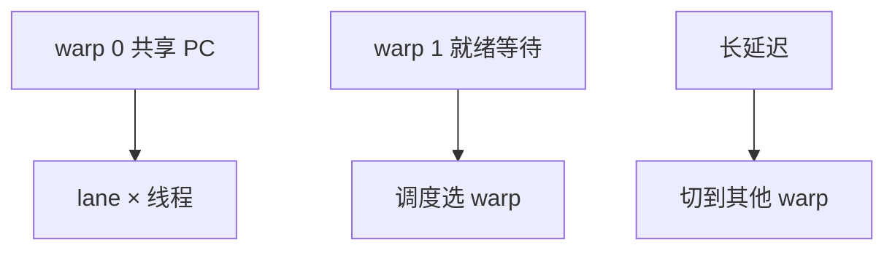

# GPU SIMT 与 warp

一组线程共享同一 PC、走同一条指令，数据各异；硬件用掩码关掉分岔的人，而不是给每人一套完整的乱序核。

<footer>—— 据 Lindholm et al., NVIDIA Tesla: A Unified Graphics and Computing Architecture, IEEE Micro 2008 整理</footer>

[上一课](/cs/vector-lanes) 的 lane 由一条向量指令驱动，程序员看见的是向量寄存器。图形与数据并行负载有成千上万个「小程序实例」。本课不重讲 Cray 链式。缺口是 **SIMT：把 lane 包装成线程，warp（或 wavefront）共享 PC，用线程切换藏延迟。** 不是 Transformer 的注意力实现。

## 问题

为每个像素/每个粒子做一套 [ROB](/cs/ooo-rob) 面积不可接受。它们的控制流大体相同。缺口不是再加 CPU 核，而是**单指令多线程：32/64 个线程一拍锁步执行同一 opcode，寄存器文件按线程号分行，遇到长延迟则换另一个就绪 warp。**

NVIDIA 称 warp，AMD 称 wavefront。Lindholm 等描述 Tesla 统一着色器：图形与计算共用 SIMT 核。这是微结构，不是 CUDA 教程。

## 方法

SM / CU 上驻留多个 warp。每拍选一个就绪 warp 发射（可宽发射多条）。寄存器：物理堆按线程切片，无 CPU 那种重命名密度。记分牌跟踪该 warp 的依赖；切换 warp 隐藏 cache/纹理/DRAM 延迟——这是 [DAE](/cs/dataflow-dae) 的线程版。

## 机制

[MLP](/cs/mlp-memory-parallelism) 来自大量 outstanding 线程，而不是单个 ROB。占用率：寄存器与共享存储限制同时驻留的 warp 数，切换不够则延迟暴露。与 CPU MIMD：每个 CPU 线程有独立 PC 与一致性协议；SIMT 线程默认不提供那种强独立控制流。下一课存储层次：共享存储、私有 L1、HBM。

分支下一课才发散；本课只钉「共享 PC + 切换」。

## 边界

本课不写 CUDA 编程模型细则，不写注意力 kernel。不要把 SIMT 说成「很大的 AVX」。多 socket CPU 仍是 MIMD。存储层次下一课。

后课默认：GPU 核用 warp 调度藏延迟。程序员看见的 bank、shared memory 与合并，决定有效带宽。

## 小结

- SIMT：warp 共享 PC，lane 上跑不同线程数据，切 warp 藏延迟。
- 面积换大量轻量上下文，而不是每线程乱序核。
- GPU 存储层次是下一课。
- 出处：Lindholm et al., *IEEE Micro*, 2008。
