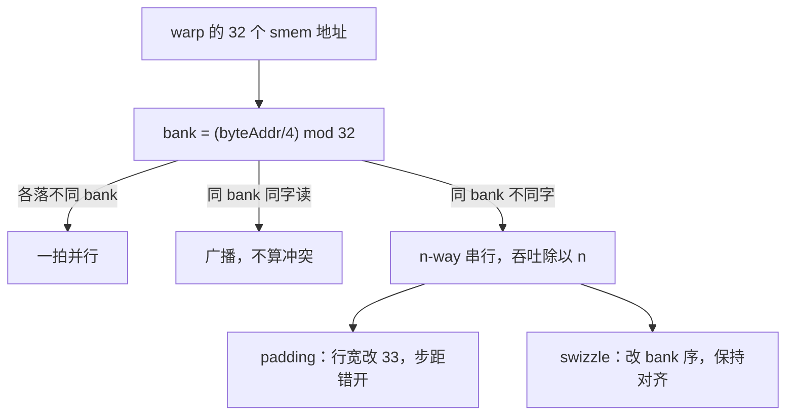
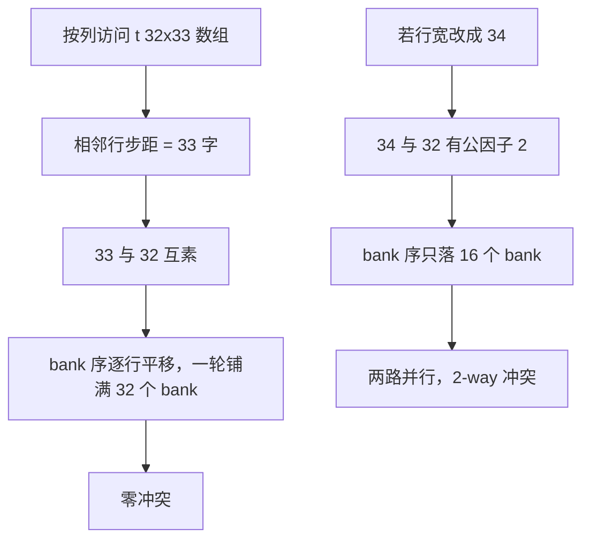

# 共享内存与 bank 冲突

共享内存的并行度藏在 32 个 bank 里：地址一挤到同一个 bank 上，一条访存指令就退化成一列排队的服务窗口。

<footer>—— 据 Kirk &amp; Hwu, Programming Massively Parallel Processors；NVIDIA CUDA C++ Programming Guide 整理</footer>

[上一课](/cs/gpu-warp-primitives)给了 warp 内的免存储通道；block 级的数据交换——tile 暂存、矩阵转置、直方图——仍要过 smem。大模型栏的 [Shared memory 与 bank conflict](/llm/shared-memory-banks) 已从 LLM 内核视角讲过 bank 交错、swizzle 与 MMA 布局的绑定，[shared memory 与寄存器预算](/llm/ak-smem-register-budget)算过容量的账。本课在 cs 栏补机制侧：冲突度怎么从地址算出来、padding 与 swizzle 各自为什么有效、以及块级屏障在这中间承担什么。

## 问题

smem 快在多 bank 并行：32 个 bank 每拍各服务一个地址，warp 的一条访存指令本可一拍完成。当多个 lane 的地址落进同一个 bank 的不同 32 位字，这条指令被拆成 $n$ 次串行服务——32-way 冲突时吞吐直接除以 32，上一课「合并访问」在全局内存上守住的带宽，在 smem 里又漏掉了。缺口是：看到一段索引代码，能不能不动手跑就说出冲突度；以及消冲突的两件工具（padding、swizzle）各自在什么条件下可用——用错场合，padding 破坏对齐合同，swizzle 改变别人依赖的布局。

## 方法

映射一行就够：$\mathrm{bank} = (\mathrm{byteAddr}/4) \bmod 32$。把 32 个 bank 想象成银行的 32 个服务窗口（bank 本义就是银行柜台）：每个窗口每拍只办一单。地址除以 4 再模 32 就是「叫号分窗」的规则；同一排 lane 的号全被叫到同一个窗口，就只好排队办——这就是 n-way 冲突。同 warp 的地址分属不同 bank，一拍并行；同一 bank 的不同字，$n$-way 串行；同一 bank 的同一 32 位字上的读，硬件广播，不算冲突。转置是标准案例：`__shared__ float t[32][32]`，写按行合并、读按列，列地址 $\mathrm{col}\cdot 32\cdot 4$ 字节模 128 后全部落进 bank 0——32-way。最便宜的修法是 padding：`t[32][33]` 之后，同一列相邻元素的步距变成 $33\cdot 4$ 字节，模 32 后逐行错开一列 bank，32-way 变成零冲突；代价是每行多 4 字节、以及行宽不再是 32 的对齐倍数。

swizzle 是第二种修法：不改数组的物理行宽，改写入时的 bank 序——典型如按 $\mathrm{bank} \mathrel{\oplus}= (\mathrm{row} \mathbin{\&} \mathrm{mask})$ 打散，读出时用同一函数还原。它保住对齐与容量，代价是布局不再「所见即所得」：每个读写方都必须知道 swizzle 函数。这正是 MMA 碎片布局与 TMA 盒子都带 swizzle 描述的原因，[llm 课](/llm/shared-memory-banks)已经看过那边的合同。

## 机制

根源是端口预算：一块 SRAM 阵列每拍只服务一个地址（[SRAM 与 DRAM](/cs/memory-array-sram-dram) 的端口账），复制 32 份换 32 路并行——bank 冲突就是并行度退回单口的那部分。32 bank 乘 4 字节等于每拍 128 字节，与一个缓存行同宽不是巧合：L1 与 smem 共用同一块存储（第二课的分账），硬件按同一粒度服务两者。padding 有效靠数论：行宽 33 与 32 互素，列访问的 bank 序变成逐行平移，一轮扫描恰好铺满 32 个 bank；行宽换成 34（与 32 有公因子 2）就只剩两路并行——padding 不是「随便加一个」，是选互素的步距。数字实例：padding 的容量代价很小——t[32][33] 比 t[32][32] 每行多 1 个 float，一块 tile 从 $32\times32\times4=4096$ 字节涨到 $32\times33\times4=4224$ 字节，多 3%；若一个 block 用 12 块这样的 tile（48 KB），总共只多 1.5 KB，换来的是把 32 倍的串行服务变成零冲突。

初学者容易把 __syncthreads 当普通函数调用随手写进 if：它是全 block 的计数屏障，只要有一个 warp 因分支没到、计数永远不齐，整个 block 就死在那里——不是变慢，是挂住。这就是「无分歧地到达」这半句在合同里的分量。

屏障是块级交换的另一半账。`__syncthreads` 是块级屏障：到的 warp 计数，凑齐才放行；它必须由全 block 无分歧地到达，写在发散分支里等于让一半 warp 在屏障外等一个永不凑齐的计数——死锁。双缓冲所以常与屏障成对出现：一轮读、一轮写，两道屏障隔开（流水侧的组合在[软件流水课](/llm/sw-pipeline-buffer)已走过）。TMA 改变的只是「谁来写 smem」（[TMA 课](/llm/hopper-tma)的结论），消费 warp 读 smem 的 bank 规划一分未免。

## 边界

MMA 布局里的 swizzle 变体（128B、64B、32B 模式）与碎片的绑定在 [llm 课](/llm/shared-memory-banks)已讲，本课不重复变体表。多 bank 模式（8 字节宽访问）与原子操作在 smem 上的语义不展开。也注意冲突不是唯一损失：容量不够导致的 tile 缩水、屏障等待、以及 smem 与 L1 的分账比例，都可能比冲突更贵——修冲突之前先用 profiling 课的证据确认它是大头。

经典直觉错误：「数组大就慢」。`t[32][33]` 比 `t[32][32]` 大 4 字节，却常快数倍——smem 的性能由 bank 序决定，不由容量决定；反过来为省容量缩行宽到 32 的倍数，很可能就是买回 32-way 冲突。

## 小结

- smem 并行度 = 32 bank 每拍各一地址；同 bank 不同字 $n$-way 串行，同字读是广播。
- bank 映射一行：$\mathrm{bank}=(\mathrm{byteAddr}/4)\bmod 32$；冲突度从索引式子直接可算。
- padding 选与 32 互素的步距（33 是标准答案）；swizzle 保对齐但要求所有读写方共知函数。
- `__syncthreads` 是计数屏障，发散调用即死锁；双缓冲靠成对的屏障隔开读写轮。
- TMA 免的是写 smem 的人，不免消费侧的 bank 规划。
- 出处：Kirk &amp; Hwu, *Programming Massively Parallel Processors*；NVIDIA CUDA C++ Programming Guide 共享内存章。
