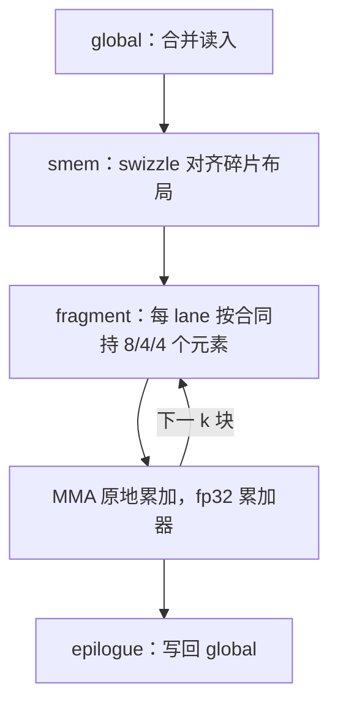

# 张量核的编程直觉

张量核不是更快的加法器，而是一纸布局合同：数据按碎片摆进寄存器，阵列才动——摆不对，312 TFLOPS 与你无关。

<footer>—— 据 NVIDIA PTX ISA 的 mma 指令文档与 A100/Hopper 架构白皮书整理</footer>

[上一课](/cs/gpu-smem-bank-conflicts)把块级交换的账算清；本课进入专用矩阵单元。大模型栏已从两个高度看过它：[Tensor Core](/llm/tensor-core) 给了它在模型里的角色，[WGMMA / wgmma 指令](/llm/wgmma)给了 Hopper 的指令合同，[cuBLAS / cuDNN 边界](/llm/cublas-cudnn)划了库的管辖。本课补最底一层的编程直觉：fragment 怎么持有、指令怎么挑、吞吐从哪来、又从哪三个口漏掉。

## 问题

FP32 CUDA core 的吞吐有硬顶：A100 全卡约 19.5 TFLOPS，而训练与推理的主算子是矩阵乘，靠通用 FMA 流水喂不出这个量。Volta 起每个 SM 配专用 MAC 阵列，fp16 稠密峰值 312 TFLOPS——16 倍的差。对程序员，新问题是抽象层级的膨胀：从 cuBLAS 到 `wmma` API 到 `mma.sync` PTX 到 wgmma，四层各控制什么、各自的布局合同多硬。直觉不过关的症状很典型：调了 tile 尺寸没效果、手写 MMA 结果错位、半精度核跑出个位数利用率。

## 方法

自底向上过三层合同。`wmma` API 以 16×16×16 的 fragment 为单位，编译器管布局，入门够用、控制粗；`mma.sync` PTX 是手写内核的主力，fp16 常用形状 m16n8k16：A 碎片 $16\times16$ 共 256 个元素摊到 32 个 lane，每 lane 持 8 个半精度；B 是 $16\times 8$，每 lane 4 个；累加器 $16\times 8$ 的 fp32，每 lane 4 个——lane 到元素的映射是指令文档钉死的合同，不是实现细节。wgmma 在 Hopper 上以 4-warp 的 warpgroup 为单元、操作数可直接取自 smem、完成靠 commit/wait 组，[wgmma 课](/llm/wgmma)已给过配对纪律，本课不重复。数据流模板在三代硬件上同构：global 合并读入 smem（swizzle 对齐碎片），smem 装载成 fragment，MMA 原地累加，epilogue 写回。

## 机制

吞吐的来源是专用化，不是频率：一个 tensor core 每拍做 256 组 fp16 FMA（512 FLOP），A100 每 SM 四个，全卡 108 个 SM 合出 312 TFLOPS。代价是数据必须按阵列要的形状就位——MMA 阵列深流水，k 方向的料断一拍，整条阵列空转一拍，所以「喂料」与「计算」必须重叠：smem 到 fragment 的搬运用双缓冲藏在上一块的 MMA 后面（[软件流水课](/llm/sw-pipeline-buffer)的 stage 账在这里兑现）。上一课的 swizzle 在这里回到正位：smem 布局要同时满足写侧的合并与读侧的碎片对齐，padding 换行宽的路数在 MMA 布局下走不通，只能 swizzle。

漏吞吐的三个口要背下来。形状口：M、N、K 不是 tile 尺寸的倍数时，padding 的算力白烧，边缘 tile 占比在小矩阵上能到一半。喂料口：k 复用不足（tile 太扁）时 MMA 等数，张量核利用率低而访存墙远没到——症状是 stall 在 wait 而非 long scoreboard，profiling 课会给证据。规模口：decode 的小 batch 使 $M$ 只有几行，阵列大部分 lane 无事可做——[wgmma 课](/llm/wgmma)的结论「峰值表不能当 decode SLA」就是这一口的极端情形。

## 边界

数值格式（fp16/bf16/fp8 的舍入与累加精度）是低精度数值的题目，本课只记一条：累加器是 fp32，别在 epilogue 之前降精度。反向传播与训练内核只借本课的布局直觉，不展开。整数与稀疏 MMA 各有自己的形状与合同，不进本课。CUTLASS 如何把 fragment、拷贝、MMA 组织成可复用的层——那是下一课的事；本课给的底线是：无论库包装多厚，布局合同最终都落在这三层抽象上。

手写 MMA 的第一张草稿不该是代码，是 lane 映射表：m16n8k16 里每 lane 持 A 的 8 个、B 的 4 个、C 的 4 个元素，位置由文档的行列分组钉死。凭直觉写索引几乎必然错位，而且错位的结果往往是「数值大体对、个别行互换」——最难查的那种错。

## 小结

- 张量核把吞吐从 19.5 提到 312 TFLOPS 的代价，是数据必须按碎片布局合同就位。
- 三层抽象：`wmma` 管布局最省心、`mma.sync` 是手写主力、wgmma 直取 smem 并以 commit/wait 管理。
- m16n8k16 的 lane 映射（8/4/4）是合同：先画表再写索引。
- 吞吐从三个口漏：形状不对齐、喂料不足、小 $M$ 打不满阵列。
- 喂料与计算重叠靠双缓冲与 swizzle，衔接上一课的 bank 账。
- 出处：NVIDIA PTX ISA 的 `mma.sync` / `wgmma.mma_async` 文档；A100 与 Hopper 架构白皮书。
