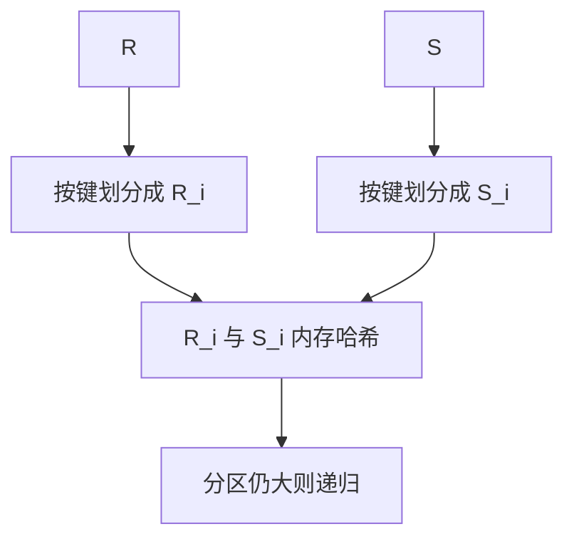

# Grace hash join

内存装不下 build 侧时，两边按连接键划分成对等分区，分区对分别做内存哈希；递归直到能放下。

<footer>—— 据 Kitsuregawa et al. GRACE；DeWitt et al. 混合哈希；Blasgen and Eswaran；主干哈希连接的溢盘补全</footer>

[上一课](/cs/hash-aggregation)对单输入分区。本课不更新组状态。缺口是等值连接在内存不够时：主干 [NLJ 与哈希](/cs/nlj-hash-join) 点名 Grace 式分区。进阶把算法钉死，并行 shuffle 后课再加网络。

## 问题

内存哈希：小侧 build，大侧 probe，一次扫描。build 超过工作内存：简单做法失败。Grace：用同一哈希函数的高位把 R 与 S 划成 $P$ 个桶文件，保证 $R_i$ 只可能连 $S_i$。然后对每个 $i$，把较小的一侧读入内存哈希，扫另一侧。若某分区仍太大，递归再划分。

混合哈希：第一分区常驻内存，其余落盘，减少 I/O。缺口是倾斜：一键对应极多行，分区无法切开该键——需要特殊处理（独立该键、或改 NLJ）。

Kitsuregawa, Tanaka, Moto-oka 的 GRACE 数据库机。DeWitt 等混合哈希。选择 build 侧仍靠估计；估错会把大侧当 build，分区文件爆。

## 方法

划分遍：顺序扫两输入，写 $P$ 对文件。处理遍：对 $i=1..P$ 做内存连接。I/O：约两输入各读两次、写一次（划分写、处理读），常数优于朴素反复扫内表。$P$ 选使期望分区适合内存。

位图过滤、布隆：probe 前丢弃必不命中行，后课 LSM 读放大也会用布隆，思想同源，结构不同。

## 机制

迭代器：划分是阻塞的（先写完文件）。向量化按批算哈希、写页。编译内联哈希函数。WAL 不记录临时划分文件；崩溃则查询失败重来，不是恢复连接中途。

外连接：分区仍按键，未匹配行在处理遍按外连接规则吐 NULL——逻辑课已钉，执行器实现分支。

## 边界

本课不讲跨节点的 exchange 与网络 shuffle——下一课并行。单机多核可用同一划分思想在内存队列上做，仍叫分区哈希。

后课默认：等值连接内存不够走 Grace/hybrid；倾斜键单独处理。并行查询把划分换成跨线程/跨节点的 exchange。

Grace 的正确性来自「同键同分区」；性能来自各分区独立且期望能放下。

## 小结

- Grace 把两输入划成对等分区再分别哈希。
- 混合哈希保留一个内存分区；倾斜键破划分假设。
- 并行查询与 exchange 下一课：把分区送到多个工人。
- 出处：Kitsuregawa et al.；DeWitt 等；Ramakrishnan and Gehrke。
