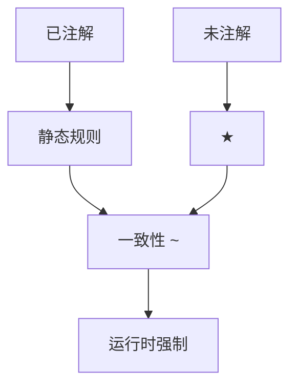

# 渐进类型

未知类型 $\star$（或 `Any`）与静态类型在同一程序里共存；交界处插入强制，运行时检查，静态侧仍要保持Blame 可追踪。

<footer>—— 据 Siek and Taha, Gradual Typing, 2006；Tobin-Hochstadt and Felleisen, Interlanguage Migration；Pierce TAPL 对照整理</footer>

上一课[效应](/cs/effect-systems)假定类型已知。缺口是**部分注解**：TypeScript、Typed Racket 让未注的部分当 $\star$，注了的部分走 STLC/HM。一致性（consistency）$\sim$ 不是 $\lt :$：$\star\sim\tau$ 对任意 $\tau$。本课钉强制与 blame，不把 TypeScript 的 `any` 逃逸当健全样本。

## 问题

全静态拒绝无注解；全动态无静态保证。渐进：检查已知部分，未知部分推迟。强制 `⟨τ⇐σ⟩` 在运行时验证。缺口是**一致性关系与插入点**，不是再写 W。

健全渐进：失败时 blame 指向打破契约的那一侧（已注解模块或未注解模块）。不健全（把 `any` 当静音逃逸）则静态承诺可被绕过。

### $\star$ 不是 HM 的新鲜 $\alpha$

$\alpha$ 须合一到具体类型或量化；$\star$ 永远可通过。把二者混淆会让「推导成功」变成「什么都没查」。

Siek–Taha 2006。Findler–Felleisen 的高阶契约是 blame 的前身。本课不写所有逐渐类型变体（transient vs guarded）。

## 方法

双向检查：已知期望类型则检验，未知则合成 $\star$ 或从语法合成。插入强制：函数强制是包装，参数逆变方向。实现：guarded 在边界包 proxy；transient 在使用处检查形状。

与[子类型](/cs/subtyping-variance)：渐进常加动态方向的宽化。与泛型擦除：强制可能只查表面标签。

## 机制

性能：proxy 改变身份与对象相等；transient 便宜但不捕获所有高阶错误。这是实现权衡，不是「渐进 = 慢」。

不要把 `@ts-ignore` 当理论的一部分。效应与渐进：未注解函数可偷偷 IO，效应系统要默认 ε 为全效应或拒绝声称纯。

## 边界

本课不把 Python typing 的全部 PEP 列完。后课默认：$\star$ + 强制 + 可选 blame。下一课类型健全性：把 STLC、渐进、线性的「不会卡在坏状态」收成定理形状。

也不把 JSON 解析当渐进类型。

## 小结

- 渐进：$\star\sim\tau$，边界强制，静态部分仍检查。
- blame 指向违约方；逃逸式 `any` 不健全。
- $\star$ 不是类型变量 $\alpha$。
- 出处：Siek and Taha, 2006；Findler–Felleisen 契约；对照 Pierce。
