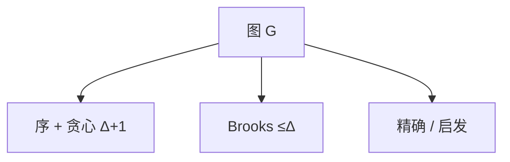

# 图着色与启发

色数 $\chi$ 是 NPC 优化；贪心按序用最小可行色，上界 $\Delta+1$；Brooks 把完全图与奇环除外收到 $\Delta$。

<footer>—— 据 Brooks, On Colouring the Nodes of a Network, 1941；Garey and Johnson, 1979；CLRS 第 34 章整理</footer>

上一课[稳定婚姻](/cs/stable-marriage-algo)给顶点配对。本课给顶点**颜色**：相邻不同色，最少色数 $\chi(G)$。判定 $k\ge 3$ 着色 NPC。不重写 GS。缺口是上界与启发式：贪心、 degeneracy 序、与精确指数算法点名。后课平面图有四色等特殊结构。

## 问题

$\chi(G)\le \Delta+1$ 总成立：任意序贪心。Brooks：连通图若不是完全图或奇圈，则 $\chi\le\Delta$。Mycielski 等造高色数低团数图，故 $\chi$ 不能只看团。缺口是算法：精确 3-着色 $O(c^n)$ 可做；实用启发式按度降序或最小度消除序（ degeneracy）贪心，最坏仍可差。

不要把「色数等于 $\Delta+1$」当常例：那只是上界。

### 贪心序不是随便

 degeneracy $d$：反复删最小度点，过程中最大度 $\le d$。则 $\chi\le d+1$。平面图 $d\le 5$，六色容易；五色、四色更细。本课一般图只收到 degeneracy。区间图、弦图有完美消除序，本课点名：那些多项式。

Brooks 1941。着色 NPC 见 Garey–Johnson。CLRS 把 3-着色当 NPC 例子。后课平面分离与四色是平面算法课，不在本课证四色。

## 方法

精确：回溯 + 位掩码（$n$ 小）或包含排斥。启发式：选序贪心；DSATUR（饱和度优先）常更好。下界：团数 $\omega\le\chi$，以及 $\chi\ge n/\alpha$。

补图着色是团覆盖，不混。

## 机制

贪心正确性平凡（局部最小色号可行）；近似比无常数保证（一般图）。与匹配：匹配是边 1-正则，边着色（Vizing）另论，$\Delta$ 或 $\Delta+1$，本课点名不证。顶点着色的交换论证弱，故启发式为主。

寄存器分配把干涉图着色，启发式够用，本课不进编译实现。

## 边界

本课不证四色、不写 Hadwiger。不把列表着色、选择数展开。后课默认：一般图着色 NPC；贪心 $\Delta+1$；特殊图类多项式。下一课平面图算法。

## 小结

- $\chi$ 判定难；贪心 $\Delta+1$，Brooks 常 $\Delta$。
- degeneracy 给出更紧的贪心上界。
- 启发不是近似比定理。
- 出处：Brooks, 1941；Garey and Johnson, 1979。
