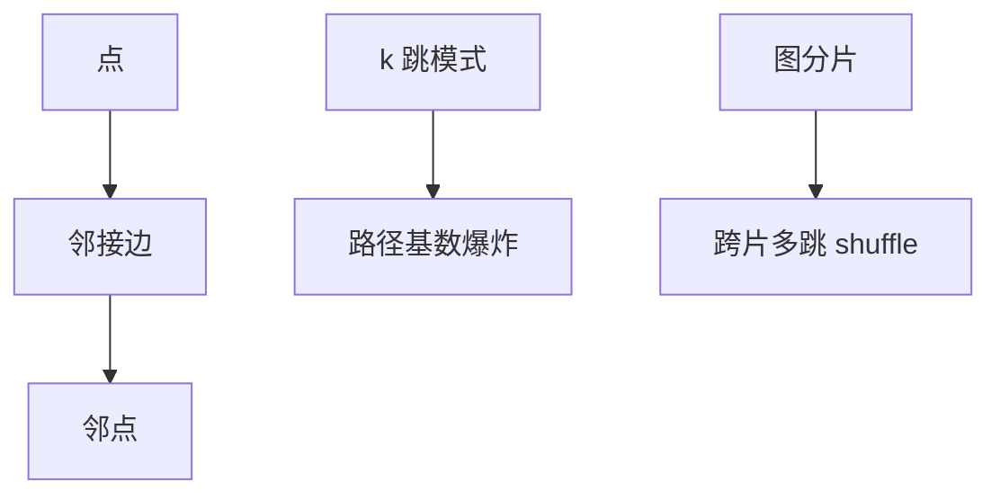

# 图数据库

点与边是一等存储：多跳邻接用指针或邻接表，不是反复自连接。查询语言是遍历与模式匹配，优化器面对的是路径基数爆炸。

<footer>—— 据 Angles and Gutierrez 图数据库；Neo4j/属性图实践；关系递归 CTE 对照</footer>

[上一课](/cs/wide-column-bigtable)靠行键编码图会把边挤进单元格。本课把图当模型：属性图（点边带属性）或 RDF 三元组。缺口是访问：关系用递归 CTE 表达传递闭包，计划弱；图引擎邻接索引让 $k$ 跳更自然，但基数估计更差。

## 问题

多对多：关系用连接表，图用边记录。遍历：从点沿边过滤。缺口是**爆炸**：度高时 $k$ 跳组合爆炸，必须限制、最短路算法、或预计算。事务：改边与点的原子，隔离下的幻边（间隙锁的图版）难。分片：图切会切断边，跨片多跳即分布式 shuffle 的最坏形状。

索引：点标签、边类型、属性 B+。全文与向量可挂在点上，后课。

Angles and Gutierrez 综述。SPARQL vs Cypher 点名。本课不教查询语法课。递归 CTE 课是关系侧对照。

## 方法

OLTP 图：局部遍历、事务。分析图：批量 Pregel/Giraph，另引擎。混合：图投影从关系 nightly 建，新鲜度合同像 HTAP。

与 ART：内存图可用邻接数组。与 LSM：边日志追加，读放大在邻居列表 compaction。

## 机制

优化器：选择率在相关邻居上独立假设更假。物理：变长邻接、CSR 只读分析。锁：点级或边级，死锁沿环路径——WFG 仍用。

关系对照：能用 SQL 几跳的不要上图库；图库赢在深度与变结构边类型。

## 边界

本课不讲时序压缩。也不把知识图谱训练当数据库课。向量 ANN 下一课之后。

后课默认：多跳 OLTP 用图引擎或限制深度的 CTE；分片图要认切边。时序数据库：时间为主键，压缩与保留策略第一。

图切分是 NP 难启发式，生产靠业务分区（租户）少切。

## 小结

- 属性图让遍历成为原生访问路径；k 跳基数难估。
- 分片切断边；分析图常用批量框架。
- 时序数据库下一课。
- 出处：Angles and Gutierrez；递归 CTE 对照。
