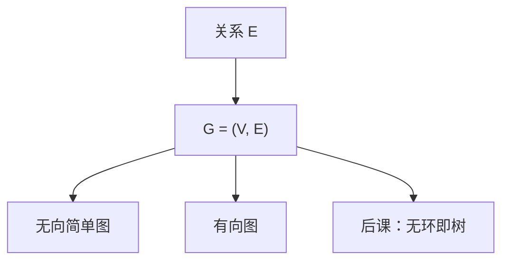

# 图的定义

图就是顶点集加上边集；边可以是无序对或有序对。后面的树、路径、算法都只是这上面的限制与过程。

<footer>—— 据 Rosen, Discrete Mathematics and Its Applications；Cormen, Leiserson, Rivest and Stein 整理</footer>

上一课[常见和式与递推](/cs/sum-recurrence)钉死了如何谈 $T(n)$ 的增长。本课不重定义 $O$，也不从「网络科学」另起。缺口是：增长要作用在什么对象上。组合逻辑的格子是超立方体的特例；一般的「点与连线」还没有定义。后课树、遍历、生成树，必须先有图。

## 问题

关系课给出 $E\subseteq V\times V$，但图论还要约定：是否允许自环、重边，无向是否把 $\{u,v\}$ 与有向对区分开。缺口因此不是新的渐近，而是把常用对象钉成：$G=(V,E)$，简单无向图无自环无重边；有向图的边是有序对。度数、路、回路、连通、强连通按标准定义。

表示（邻接表、邻接矩阵）是数据结构课的叶子，本课只承认 $|E|$ 相对 $|V|^2$ 可以稀疏或稠密，以便写 $O(V+E)$。算法过程不在本课展开。

### 图画不是定义

课堂上的点线图是示意图。自环、多重边是否存在，必须在 $E$ 的类型里说清。把「看起来连着」当成边，后课证明会漏情况。也不要把社交「图」的权重、时间戳塞进本课：那是标注，本课先无权重。

Rosen 先无向后有向。CLRS 附录 B 给算法用的图词汇。本课两者都要：后课 FSM 是有向的，生成树先在无向连通图上说。

## 方法

简单无向：$E$ 是 $V$ 的二元子集族。有向： $E\subseteq V\times V$。走：顶点边交错序列。路：顶点不重复。连通：任意两点有路。分量是极大连通子图。

## 机制

有了 $G$，渐近才有参数：$T$ 写成 $|V|$、$|E|$ 的函数。后课 BFS 的正确性用「距离层」，那是路的长度；本课只提供路。布尔最小项的超立方体是图，卡诺相邻是边，那是已经用过的特例，现在一般化。

握手引理：无向图度数和为 $2|E|$。证明是归纳或对边计数，给后课欧拉回路预备，本课不展开欧拉。

## 边界

本课不引入平面性、着色定理，不把加权最短路的算法写出来。无限图不进主干：后课输入有限。超图、单纯复形不出现。

后课默认：谈到图，$G=(V,E)$ 有限；无向默认简单，除非声明重边。树是下一课的特化。

## 小结

- 图是顶点加边；有向与无向由边是否有序决定。
- 路、连通、度数是后课算法的词汇，本课只定义。
- $|V|$、$|E|$ 是渐近的参数；表示法后置。
- 出处：Rosen；CLRS 附录 B。
