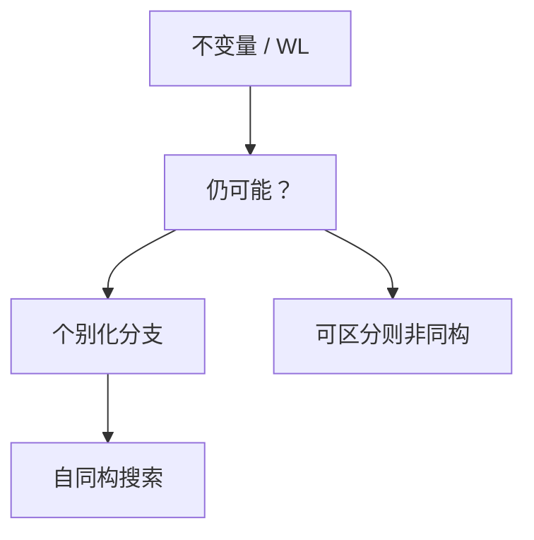

# 图同构直觉

是否存在保持边的双射，既未证明 NPC，也长期未进 P；实践靠不变量与个别化，理论侧有准多项式。

<footer>—— 据 Read and Corneil, The Graph Isomorphism Disease, 1977；McKay, nauty；Babai, Graph Isomorphism in Quasipolynomial Time, 2016 整理</footer>

上一课[平面图算法](/cs/planar-algorithms)有线性平面性。图同构（GI）：是否 $G\simeq H$。本课不重写平面嵌入。缺口是问题的**复杂度地位**与实用算法形状：度数序列、Weisfeiler–Leman 染色、个别化–加细，而不是再给一个 NPC 归约。本序列「连通、树与匹配」在此收束。下一单元最短路加速。

## 问题

GI 在 NP：证书是双射。coNP 不明显（要证没有双射）。许多图类多项式：树、平面、有界度数（Luks）。一般图：Babai 2016 准多项式 $\exp((\log n)^{O(1)})$。实践：nauty 等用自同构群搜索 + 不变量剪枝，随机图上极快。

缺口是「不要当 NPC 教」，不是给出完整群论证明。

### 同构不是哈密顿

哈密顿有简单的 NPC 归约；GI 没有已知的这类归约，也未被证明 P。不要把「看起来组合爆炸」写成 NPC。子图同构（含给定 $H$）是 NPC——那是另一问题。

Read–Corneil 1977 综述「疾病」。McKay 的 nauty 是标准工具。Babai 2016 准多项式（随后修订）。Weisfeiler–Leman 染色是高维不变量。后课 A* 换最短路启发式，不再问双射。

## 方法

先比度数、连通支、谱等不变量。WL：按邻域色的多重集迭代加细，直到稳定；色相同未必同构（正则图）。个别化：固定某点打破对称，分支搜索。树同构：AHU 规范编码线性。

规范标记：给每个图一个串，相等当且仅当同构；实用算法常输出标记。

## 机制

对称性（大自同构群）使分支爆炸，个别化针对轨道。平面图可用嵌入的组合映射。与着色：WL 是颜色细化，不是 $\chi$。不要用指数枚举双射当主算法——$n!$ 无剪枝。

## 边界

本课不证 Babai 全文，不写群的 Schreier–Sims。不把分子图同构当化学课。后课默认：GI 特殊；实用靠不变量+搜索；理论准多项式。下一课 A*：启发式最短路。

## 小结

- GI 在 NP，未证 NPC，有准多项式。
- 子图同构才是 NPC；不要混。
- 实践：WL、个别化、nauty。
- 出处：Read and Corneil, 1977；Babai, 2016；McKay nauty。
