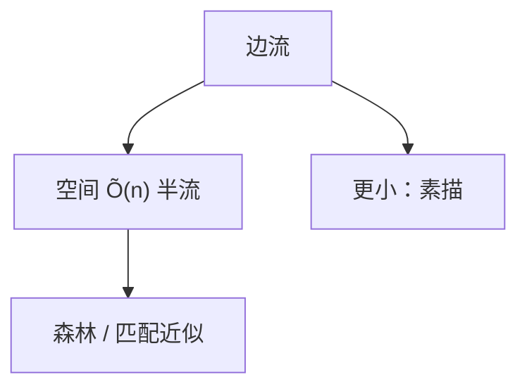

# 图流与半流算法

边以流的形式到达，内存远小于 $n$：连通、匹配、最短路都要抽样、素描或多遍；半流允许来回扫存储。

<footer>—— 据 Muthukrishnan, Data Streams: Algorithms and Applications, 2005；Feigenbaum 等图流早期工作整理</footer>

上一课[动态连通性](/cs/dynamic-connectivity)假定图在内存里改边。图流：边序列一次或少数次经过，空间 $O(n\,\mathrm{polylog}\,n)$ 或更小。不重写 Holm 的森林。缺口是流模型下还能回答什么：连通性素描、生成树的障碍、匹配的近似。本单元「最短路与动态图」在此结束；下一单元数值与代数。

## 问题

插入流：边只加。动态流：边可删（更难）。半流（semi-streaming）：空间 $\tilde O(n)$，可存生成树级别。已知：半流可维护生成树（插边）；匹配有常数近似；最短路精确一般不行。更小空间要 sketch（连通分量的线性素描）。

缺口是空间预算，不是 CH。不要声称流上线性时间精确最大流——模型不允许邻接表随机访问。

### 一遍过不等于在线算法

在线算法对不可撤回决策比竞争比；流算法可事后输出，只是内存小。后课竞争比另开。本课内存。

Muthukrishnan 2005 综述流。图流半流成为标准分层。 Ahn–Guha–McGregor 线性素描做连通。后课快速幂离开图。

## 方法

半流连通：存森林，插边若连接不同块则加。匹配：贪心边或更精的分层近似。计数三角形要抽样或多遍。输出常常是近似或随机正确。

下界：一通扫描难以精确 $s$–$t$ 连通的某些变体，点名即可。

## 机制

$\tilde O(n)$ 刚好放下树，故半流连通「像」动态插入。删边流要更多遍或随机。与 Misra–Gries 等项计数流（后课）不同：这里有顶点身份，空间至少与 $n$ 有关。与 PRAM：并行是时间，流是空间。

## 边界

本课不写全部图流下界表。不把 MapReduce 当半流定义。后课默认：图若只能扫边，先问半流空间；精确最短路回随机访问模型。下一课快速幂与矩阵幂。

## 小结

- 半流 $\tilde O(n)$：森林级结构可维护。
- 精确很多问题要随机访问；流上近似/多遍。
- 与在线竞争比模型不同。
- 出处：Muthukrishnan, 2005；图流与线性素描文献。
