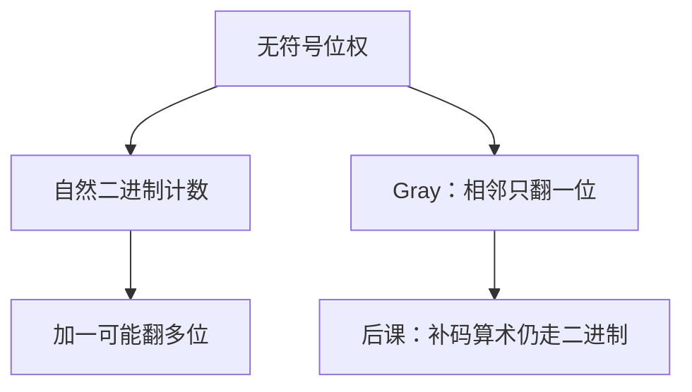

# Gray 码

相邻的两个整数，在反射二进制里只翻一比特；自然二进制从 $0111$ 到 $1000$ 却同时翻四位。

<footer>—— 据 Gray, Pulse Code Communication, U.S. Patent 2,632,058, 1953；Knuth, The Art of Computer Programming, Vol. 2 整理</footer>

上一课[进制与位权](/cs/positional-notation)钉死了：比特串加上基与位权才成为无符号整数，加法默认模 $2^n$。本课不重讲权怎么排，也不从「编码理论」另起。缺口是：自然二进制下，数值加一可以同时翻转很多位。机械盘、卡诺图相邻、后课异步接口，都怕这种「多位一起变」。

## 问题

位权编码让电路对齐同一权再加，这是上一课的收获。计数、扫描、把连续角位移判成整数时，相邻两个值若汉明距离很大，采样落在中间会读出既不是旧值也不是新值的串。缺口因此不是新的基，而是另一种**枚举次序**：仍用 $n$ 比特标 $\{0,\ldots,2^n-1\}$，但相邻整数的码字只差一位。

反射二进制 Gray 码满足这条。它不是另一种位权：各位不再独立表示 $2^i$。算术仍在自然二进制里做；需要相邻只翻一位时，再换成 Gray。有符号还没有，本课整数仍无符号。

### Gray 不是「把进位去掉」

模 $2^n$ 加法照样进位，只是进位发生在二进制解释里。Gray 的相邻性是码表几何，不是加法器少了一根进位线。把两者混成「无进位二进制」，后课全加器会没有对象。

Gray 1953 的专利把反射二进制用于脉冲编码。Knuth Vol. 2 把位权系统写清楚之后，其余枚举都当成「同一整数的不同写法」。后课卡诺图的格子邻居，用的就是本课这条相邻。

## 方法

记自然二进制为 $i$，一位 Gray 码 $G(i)=i\oplus\lfloor i/2\rfloor$（逐位异或）。反变换：从最高位起，二进制位等于 Gray 位与已经恢复的更高位异或。本课不把异或提升成布尔公理——那是[布尔代数](/cs/boolean-algebra)的缺口；这里只当比特上的可逆映射。

$n$ 位 Gray 码正好 $2^n$ 个，与上一课 $|\Sigma^n|$ 相同，只是相邻关系改了。循环意义上 $0$ 与 $2^n-1$ 也只差一位，构成一条哈密顿圈；本课不把图论请进来。

## 机制

转换是异或与移位，门数与 $n$ 成正比，不改字宽。后课组合逻辑把最小项排进格雷码网格，几何相邻才等于差一个变量。旋转编码器输出 Gray，避免位置卡在进位边界时读出野码。这些都不取代位权：要做加减，先变回二进制。

## 边界

本课不引入汉明距离的公理定义，只用「差几位」。纠错码的最小距离是[后课](/cs/hamming-distance)。也不把 Gray 当成补码：下一课[补码与溢出](/cs/twos-complement)仍在自然二进制的模 $2^n$ 上取负。多位同时变的险象，要等组合电路课才命名。

后课默认：无符号算术用位权二进制；需要相邻只翻一位时，使用反射 Gray 码，再转换回来。

## 小结

- 自然二进制加一可翻多位；Gray 码让相邻整数只差一位。
- Gray 不是位权，加减仍在二进制里做。
- $G(i)=i\oplus\lfloor i/2\rfloor$ 可逆。
- 出处：Gray, 1953；Knuth, TAOCP Vol. 2 对同一整数不同写法的处理。
