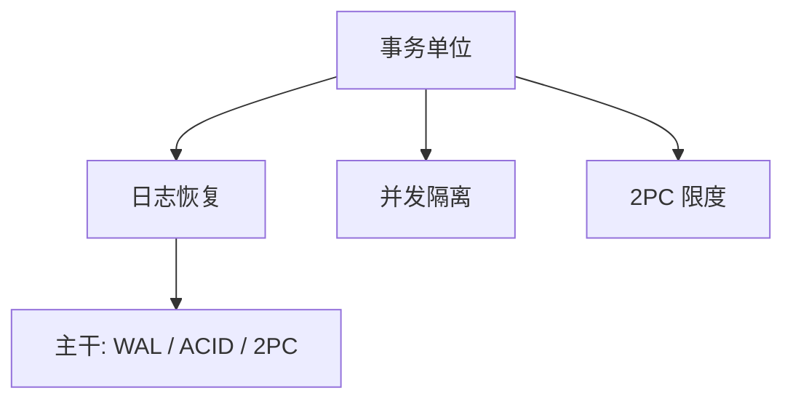

# Gray 事务

把一组读写收成原子、可恢复的单位；失败则像没发生，成功则持久——事务是系统概念，不是 SQL 方言。

<footer>—— Gray, The Transaction Concept: Virtues and Limitations, 1981；对照 Notes on Database Operating Systems, 1978</footer>

[上一课](/cs/codd-relational)附录对照了 1970 年关系与数据独立性。附录对照，不插入主干。主干已在[ACID](/cs/acid)、[WAL](/cs/wal)、[两阶段提交](/cs/two-pc)里用过事务规格与日志；这里对照 **Gray 原文的问题**：共享数据上的并发与故障如何用事务收口，以及 2PC 的阻塞限制。不重做 ARIES 三阶段——那是 Mohan 1992。

## 问题

Codd 给出关系与完整性，不管崩溃与交错。Gray 的缺口是：把「一次业务」做成全有或全无，用日志与锁（或等价物）同时服务并发与恢复。1981 文写美德与限度：长事务、嵌套、分布式投票会卡住。主干把 ACID 四字母放在检查点之后上课，物理上先 WAL 后规格；附录对照概念从哪篇工程传统来。

Haerder and Reuter 1983 把 ACID 缩写写开。Gray and Reuter 后来的书是教材级展开。不要把 ARIES 作者名单写回 1981。

## 方法

事务：begin 到 commit/abort。恢复：先写日志。并发：锁或版本，目标是可串行或可恢复调度。分布式：2PC 的准备与决策，协调器日志是支点——主干 2PC 课已取用 Lampson/Sturgis 与 Gray 这一线。限度：投票阶段阻塞、启发式决策。

## 机制

事务把[缓冲与脏页](/cs/buffer-dirty) 的不一致收成可命名的提交点。关系模型提供对象，Gray 提供对象上的故障与并发合同。后文 Diffie–Hellman 换栏到公钥，与提交无关。

### 为何对照而不插入主干

主干数据库从套接字缺口进入关系，物理页与 WAL 在代数之后。把 1981 插在 Codd 之后当「下一课」，会跳过键、SQL 与计划。附录只对照事务作为系统概念的出处，不改变课序。

## 边界

不要把 1981 概念文与 1992 ARIES 实现文混成一篇。也不要在附录里开 Saga 补偿的全部语义。下一篇对照 Diffie–Hellman 1976。

对照结束应回到主干[ACID](/cs/acid)与[WAL](/cs/wal)。Gray 不插入 SQL 课之前。

## 小结

- 附录对照 Gray：事务是原子可恢复单位，2PC 有限度。
- 主干 ACID/WAL/2PC 已取用；ARIES 是后一篇实现传统。
- 出处：Gray 1981；对照 1978 Notes；Haerder and Reuter 1983 缩写。
