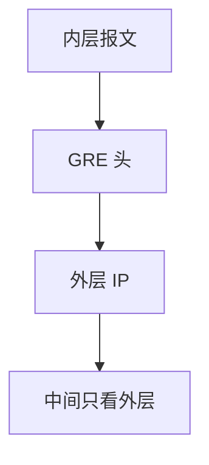

# GRE 与隧道

GRE 把任意载荷装进另一张 IP 头，中间只转发外层；简单、无状态，校验、MTU 与安全都要另配。

<footer>—— 据 RFC 2784 GRE；RFC 2890 密钥与序号；RFC 7676 IPv6 上的 GRE 整理</footer>

[VXLAN](/cs/vxlan-overlay) 与 [MPLS](/cs/mpls) 已是隧道。[上一课](/cs/evpn) 是控制面。缺口是**最简 IP 隧道**：GRE、何时用、与 IPsec/NVGRE 对照。本课不把 IGMP 写完。

## 问题

要把非 IP 或私网 IP 穿过只懂公网的核心：外层源/目的是隧道端点，内层原样。GRE 无内置拥塞与加密；序号可选。中间 ECMP 只看见外层五元组，熵不足则极化——VXLAN 用 UDP 源端口，GRE 常靠外层 IP 与 GRE 头。递归：隧道口的 MTU 必须小于底层，否则内层 PMTUD 黑洞（后课）。

不要把 GRE 当成 VXLAN 替代租户隔离：没有 VNI 标准语义，除非你自己编 key。

RFC 2784。PPTP 等历史用法不展开。IPsec 隧道模式是安全对照，不是 GRE 的升级补丁。

### 无状态封装

中间只看外层 IP。无内置加密与 VNI 语义。Keepalive 是实现特性。递归 MTU 是黑洞温床。

## 方法

对照：GRE / VXLAN / MPLS / IP-in-IP。画：内层包 → GRE → 外层 IP → 核心 LPM。与蜂窝 GTP 同类：锚点隧道。

方法止于选定对象与对照；机制才说它如何嵌入已有分层与主干课。

## 机制

OSPF 可在隧道上建邻接（小心递归与 MTU）。流量工程可把 GRE 当一条逻辑边，度量人工设。RSTP 不应把隧道当二层边除非你做了桥——那会把环带进核心。卫星链路上 GRE 只加头税，不减 RTT。

Keepalive 是实现特性，标准 GRE 无强制 Hello。

## 边界

本课不引入 WireGuard 的加密握手。多播 IGMP/PIM 是下一课。后课默认：GRE 是无状态封装；隔离与安全要另加。

把整个互联网当 GRE 网是 NAT 穿越的权宜，不是架构目标。

上一课留下的缺口在本课收口；「GRE 与隧道」进入后课词汇表后只引用。文献用来钉对象与边界，不把本课写成该主题的独立综述。下一课[多播 IGMP / PIM](/cs/multicast-igmp-pim)。

## 小结

- GRE：外层 IP 转运，中间无内层状态。
- 熵与 MTU 是隧道共同税。
- 不提供 VPN 密钥语义或 VNI。
- 后课只引用本课钉死的对象，不从该领域总问题重开。
- 出处：RFC 2784；RFC 2890。
