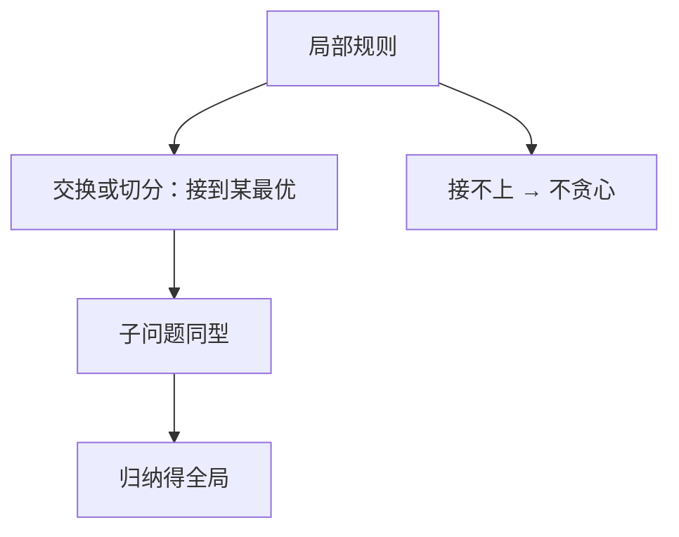

# 贪心正确性

局部最优要能接到某个全局最优上：要么交换论证补成最优，要么最优子结构允许先做这一步。

<footer>—— 据 CLRS 第 16 章；活动选择与 Huffman 的标准论证整理</footer>

上一课[Aho–Corasick](/cs/aho-corasick)是线性扫描，不是逐步选「当前最便宜」。此前 MST、Dijkstra 已经用过贪心，但没有单独说**何时允许**。本课不重跑 Kruskal。缺口是：把「每步取看起来最好的」写成可证的模板——**贪心选择性质** + **最优子结构**——并标明失败的典型样子。后课动态规划处理贪心不够时的重叠子问题。

## 问题

活动选择：不重叠区间里最多选几个。按结束时间最早贪心，交换论证：任何最优解若第一步不同，可换成这个最早结束而不减个数。Huffman：权最小的两棵树合并，类似。缺口不是再给一个具体算法，而是承认：**贪心不是定义，是要证的性质**。没有证明，反例（找零在某些币制、背包按密度）会静默错。

Dijkstra/MST 已是安全边或钉死距离；本课把同一类论证叫出来，供后课对照 DP。

### 贪心不是「快」的别名

有的贪心很慢，有的 DP 很快。对错与渐近无关。分数背包按密度贪心对；0-1 背包不对——那是[背包](/cs/knapsack)的缺口，本课先把「密度看起来好」列为未证明就不可用。

CLRS 第 16 章用活动选择当第一份交换论证。Matroid 给出一类自动正确的贪心，本课点名不展开公理。Huffman 1952 是编码树实例。

## 方法

写清候选的局部规则。证明：存在最优解包含这一步（或可改造成包含）。剩余子问题同型，归纳。失败时给最小反例，改走 DP 或别的。

[循环不变式](/cs/loop-invariant)仍可用：已选集合始终可扩展成最优。那是同一证明的迭代写法。

## 机制

安全边、最早结束、Extract-Min 都是本模板的实例。后课 DP 也要最优子结构，但**多分支都要算**：因为不知道哪条局部选择对。贪心是「证明只需走一条」。

Huffman 树、活动选择留在 P。后面的 NPC 课不要把「旅行商最近邻」当贪心成功案例。

## 边界

本课不引入拟阵证明。不写近似比（贪心近似是另一层）。0-1 背包、最短超串等失败例只点到，完整 DP 在下一课。也不把 Dijkstra 再证一遍。

后课默认：先问贪心选择是否可证；不能证就不要实现成贪心。重叠子问题与备忘是动态规划的缺口。

## 小结

- 贪心正确 = 贪心选择性质 + 最优子结构，需证。
- 交换论证把局部接到某全局最优。
- 密度、最近邻等未证则不可用。
- 出处：CLRS 第 16 章；Huffman, 1952。
