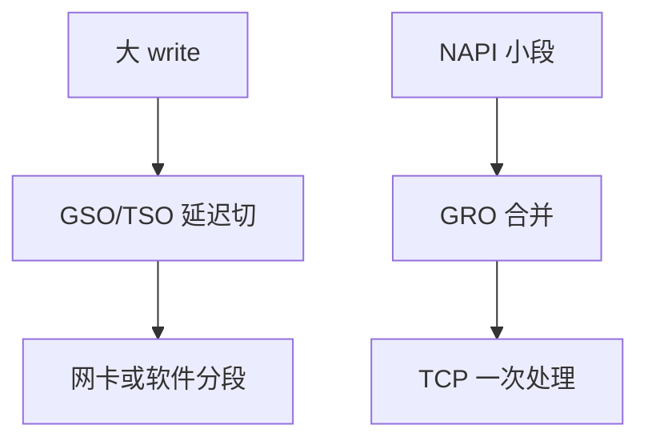

# GRO / GSO

GRO 在接收路径把同流的小 TCP 段合成一个大 sk_buff；GSO/TSO 在发送路径把大缓冲推迟到网卡或最后一刻再切开。

<footer>—— 据 Linux GRO/GSO 文档；Corbet 对 TSO 的 LWN 整理</footer>

[上一课](/cs/napi)已经批量收描述符。若每 1500 字节走一遍 TCP 状态机，PPS 上限太低。缺口是 **聚合与延迟分段**：逻辑上仍是字节流，物理上少跑几次协议。

## 问题

TSO：应用 `write` 64KiB，内核当一包，网卡切成 MSS。无 TSO 则软件 GSO 在出队前切。GRO：相反，NAPI 里把连续 ACK 流合成大 skb，交给 TCP 一次。缺口：必须核对序号、校验、时间戳选项，否则会拼错流；UDP GRO 是后来的亲戚。本课不把 QUIC 卸载写成标准。

LRO 是更早、更粗的硬件聚合，可能破坏语义；GRO 在软件里可验证。GSO 与 UFO（UDP）同类。

## 方法

发送：TCP 把大 skb 标 `gso_size`，qdisc 之后 `validate_xmit_skb` 决定硬件 TSO 还是软件切开。接收：`dev_gro_receive` 按流哈希找桶，合并成功则延迟 `netif_receive_skb` 直到 poll 结束或无法合并。对照 [sk_buff](/cs/skbuff)：frags 变长，`gso_segs` 计数。对照 sendfile：大页天然适合 TSO。

## 机制

GRO/GSO 把「MTU」从协议 CPU 成本里解开：主机看见大段，线路仍是合法 MTU。这是网络栈与存储大块 I/O 对应的那一课。不要写成量化撮合批处理。校验卸载（checksum offload）常与 TSO 绑定：硬件算 TCP 校验。

错误：GRO 拼错会坏流，实现必须保守；虚拟化时要在 vhost 上再做一次。

实现上：GRO 合并失败必须立刻上送，否则延迟 ACK 被自己拖死。TSO 依赖校验卸载，若硬件不做 checksum，软件 GSO 仍要切。隧道要 inner/outer 两套 gso 信息。 读法上只引用[上一课](/cs/napi)的结论，不把对象换成训练推理或限价簿。

本课在操作系统进阶的「网络栈 / 收发路径」课序里，对象是 **GRO / GSO**。

- 先修只引用，不重导：上一课的结论当公理，本课只补差。
- 五栏不吞并：不把本课写成大模型训练/推理，也不写成限价簿或权重量化。
- 文献用 OSTEP、McKusick、内核文档与具名会议论文；不发明 arXiv 编号。

## 边界

本课不引入 GSO 对隧道封装的全部 inner/outer。不保证所有 virtio 特性位。下一课把 NAPI 之后到套接字之前串成接收路径。

版本字段会变，课序钉的是机制对象「GRO / GSO」，不是某一主线内核的结构体名。
后课默认：可在收发两侧做段聚合/延迟切。从驱动到 TCP 的上行路径，下一课。

## 小结

- GRO 收侧合并；GSO/TSO 发侧延迟分段。
- 目的是少跑协议栈，不是改 TCP 语义。
- 接收路径是下一课。
- 出处：Linux networking；LWN TSO/GRO；Benvenuti。
