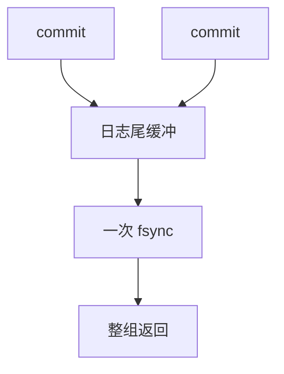

# 组提交

许多事务的 commit 记录挤进同一次日志 fsync：延迟换吞吐，持久性不等式仍是「提交返回 ⇒ 日志已落」。

<footer>—— 据 Gray and Reuter 组提交；Mohan；磁盘与 NVMe 上的 WAL</footer>

[上一课](/cs/shadow-paging)对照切根。本课回到 WAL 路径的刷盘：每个提交都 `fsync` 则磁盘 IOPS 打满，吞吐上不去。组提交（group commit）把一个日志缓冲里的多个 commit 一起刷。持久性等级下一课把「刷到哪」再分级。

## 问题

提交延迟 ≈ 等刷盘。组：领导者收集一个窗口内的提交者，一次 I/O，大家一起返回。缺口是**窗口**：等太久延迟差；不等则退化成每提交一刷。自适应窗口看队列长度。与并行：组提交是日志尾的串行点，是 OLTP 扩展上限之一——可分区日志缓解，复杂度高。

steal/no-force 仍成立：数据页不必在组里刷。只刷日志。

Gray and Reuter。MySQL/Postgres 都有组提交实现。本课不调某个 `commit_delay` 参数表。

## 方法

日志缓冲满或超时或 N 个 commit → flush。返回后事务可见（按隔离：提交可见性还要看锁释放点）。备库半同步后课会等备库 ACK，组提交窗口与复制 ACK 可叠。

崩溃：组里已刷的全提交，未进这次刷的全部 abort——原子的是这一刷。

## 机制

与 TDE：加密日志页再刷，CPU 进组路径。与双写：数据页路径独立。校准：优化器不管组提交，但基准 TPC-C 对它极敏感——后课基准。

无组提交时，用户同步提交延迟=单次 fsync；SSD 仍有上限。

## 边界

本课不定义 RPO 的全部等级。也不把组提交当 2PC。异步提交（先返回再刷）属于下一课耐久性放松。

后课默认：同步提交走组刷日志。持久性等级：同步、异步、备库参与。

组提交不改变 WAL 不等式，只改变每次 I/O 摊到多少事务。

## 小结

- 多 commit 共享一次日志 fsync，吞吐升、尾延迟可能升。
- 崩溃原子单位是这一刷。
- 持久性等级下一课。
- 出处：Gray and Reuter；ARIES 实践。
