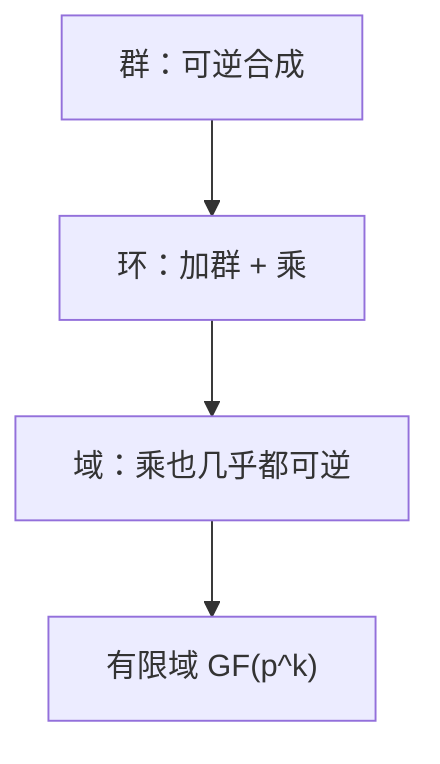

# 群、环、域直觉

群管可逆合成；环加一套乘法分配；域让四则都可做。密码学选的是具体群（模 $p$ 乘群、椭圆曲线），不是抽象公理课。

<footer>—— 据 Artin, Algebra；Ireland and Rosen 整理</footer>

上一课[CRT](/cs/crt) 把 $\mathbb{Z}/mn\mathbb{Z}$ 写成乘积环。缺口是给结构**命名**：群、环、域，以便后课 $\mathrm{GF}(2^n)$、离散对数、椭圆曲线共用一句话「在哪个群里」。不重写同余。

## 问题

群 $(G,\cdot)$：结合、单位、逆。交换则 Abel。$(\mathbb{Z}/n\mathbb{Z})^\times$、椭圆曲线点（后课）是乘/加群。[布尔](/cs/boolean-algebra) 的 $\{0,1\}$ 加法若取异或也是群。环：加是 Abel 群，乘结合分配，不必有乘逆。域：环且 $0$ 除外都有乘逆。$\mathbb{Z}/n\mathbb{Z}$ 是域 $\iff n$ 素数。有限域阶必 $p^k$，下一课构造 $k>1$。

同态：保运算。DH 在循环群；RSA 在环 $\mathbb{Z}/n\mathbb{Z}$ 的乘。

### 不是「把小学算术换名字」

公理用来禁止非法步骤：环上不能除，非交换群不能随便换序。证明「只有一种 $p^k$ 阶域」是后课，本课要判别：眼前对象缺哪条公理。

Artin 的本科代数。本栏只要直觉与例子。Lagrange：有限群子群阶整除 $|G|$，欧拉定理是其推论，上一课已用。

## 方法

列一张表：$\mathbb{Z}$ 环非域；$\mathbb{Q}$ 域；$\mathbb{Z}/6\mathbb{Z}$ 环非域；$\mathbb{Z}/5\mathbb{Z}$ 域。指出 DH 要循环群生成元，RSA 要环上幂等结构。不要从范畴论起。

## 机制

后课每个对象先回答：运算是什么、是否可逆、是否交换。离散对数是群上的问题；LWE 在模格上，不是同一公理。本课防止「都是数学」混为一谈。

有限交换群分解为循环群的积（主理想分解），点名：DH 安全要避开光滑阶。

Lagrange 推论：元素阶整除 $|G|$，欧拉定理是 $(\mathbb{Z}/n\mathbb{Z})^\times$ 的特例。有限域乘群循环（后课生成元）。非交换群上也可以谈 DH 形状（矩阵群），安全分析不同，本课不进。公理的用处是读协议时先问「除法合法吗」。

## 边界

本课不证分类定理，不引入理想、模。不把椭圆曲线加法公式提前。后课默认：域上四则合法；群上有阶与逆。下一课 $\mathrm{GF}(2^n)$。

先问运算、再问逆、再问交换。域上才能随便除；RSA 模 $n$ 不是域。有限域阶 $p^k$ 的构造下一课从特征 2 写起。公理用来禁止协议里的非法约分。

上一课留下的缺口在本课收口；「群、环、域直觉」进入后课词汇表后只引用。文献用来钉对象与边界，不把本课写成该主题的独立综述。

## 小结

- 群 / 环 / 域差在逆与两条运算。
- $\mathbb{Z}/n\mathbb{Z}$ 为域当且仅当 $n$ 素。
- 密码学选具体群，公理用来禁止乱除。
- 出处：Artin, *Algebra*；Ireland and Rosen。
