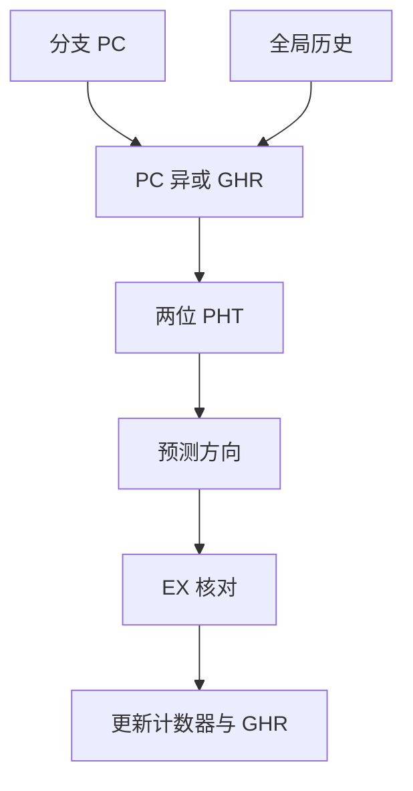

# gshare 预测器

把全局历史与分支地址异或后再去索引模式表，别名少、硬件也省；锦标赛只是再加一路局部预测来仲裁。

<footer>—— 据 McFarling, Combining Branch Predictors, DEC WRL TN-36, 1993 整理</footer>

[上一课](/cs/isa-abi-boundary)把数字系统收到 ISA/ABI 合同：寄存器、调用约定、端序与对齐已经固定。[组成主干](/cs/control-hazard-predict)已经用一位饱和计数器猜方向，[BTB 与返回栈](/cs/btb-ras)已经把目标从 ALU 里抢出来。本课不重讲冲刷，也不从比特或证明助手再起。缺口是：相关分支——「前一次比较的结果改写这一次该不该跳」——一位表按 PC 索引看不见这条相关。微结构进阶从这里开始：先交出 gshare。

## 问题

循环结尾的 `bne` 几乎总成功，出循环那一次失败：两位饱和计数器要错两次才改过来。更糟的是 `if (a) … if (a && b)`：第二条的方向与第一条相关，按 PC 分槽的 PHT 把两次当成独立硬币。Yeh 与 Patt 的两级自适应（全局/局部历史寄存器去索引第二级表）已经点名这件事；直接用长历史当索引，表项爆炸，且不同 PC 挤在同一行。缺口不是再加一位计数器，而是**用少量全局历史，按地址散列进一张两位表**。

McFarling 把「全局历史」方案叫 GAs 一类；gshare 是把 PC 与 GHR 异或。他同时提出 bimodal 与 gshare 的锦标赛（tournament）。

## 方法

维护一条移位寄存器 GHR：每条退休（或至少核对过的）条件分支把 0/1 推进来。预测时取 `index = PC ⊕ GHR`（截到表宽），读两位饱和计数器：≥2 猜成功。核对后按普通饱和规则 ±1，并移位 GHR。

与纯 GHR 索引比，异或让同一段历史在不同 PC 上散开，减轻别名。与纯 PC 索引比，同一 PC 在不同历史上走不同槽，相关被记住。

## 机制

误预测率进 CPI：[控制冒险](/cs/control-hazard-predict) 的公式仍是频率 × 误预测 × 损失拍。乱序核损失拍数比五级大一个数量级，所以表要准。gshare 的历史长度是交易：太短看不见相关，太长则训练慢、别名多。锦标赛再加一张局部（每 PC 一段历史）和选择器：两种预测器各对一类分支，选择器本身也是饱和计数器。

gshare 状态不是 ISA。上下文切换不必保存；冷表只让误预测暂时升高。推测执行会用推测中的分支去更新 GHR，错了要恢复——那是后课恢复检查点，本课只要求「有一份架构 GHR 在核对后提交」。

## 边界

本课不引入 TAGE 的几何长度与部分标签，不引入感知器的权重和。间接跳转仍走上一课的 BTB；gshare 只管条件方向。也不把预测器写成可被用户读写的 CSR。

后课默认：谈到相关预测，先想到 PC 与 GHR 的异或索引；损失拍仍按核对点到 IF 的深度计。更长、可变的历史是下一课 TAGE。

## 小结

- 相关分支要用全局历史，不能只按 PC 查一位表。
- gshare 用 `PC ⊕ GHR` 索引两位 PHT，是 McFarling 对两级表的实用化。
- 几何历史与标签匹配是下一课的缺口。
- 出处：McFarling, *WRL TN-36*, 1993；Yeh and Patt, 两级自适应预测。
