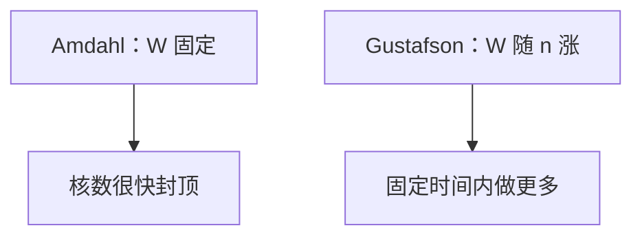

# Gustafson 定律

Amdahl 钉死的是固定工作量下的加速比；Gustafson 说机器变大时工作量也变大，串行段占比可以下降，扩展才有意义。

<footer>—— 据 Gustafson, Reevaluating Amdahl's Law, CACM 1988 整理</footer>

[上一课](/cs/multi-socket-interconnect) 让并行机可以加 socket。[CPI 与阿姆达尔](/cs/cpi-amdahl) 已经给出固定问题规模的上限。本课不重讲 NUMA 链路。缺口是 **Gustafson：规模可变时的加速比定义**，避免「永远 5% 串行所以 20 核封顶」被误用到弱扩展场景。

## 问题

Amdahl：工作量 $W$ 固定，$s$ 为串行比例，加速比 $\le 1/(s+(1-s)/n)$。科学计算常在核数增加时把网格加密：并行段涨，串行初始化几乎不变。缺口不是新的 NoC，而是**换分子：把 $n$ 核上跑得动的更大问题当作「同等时间」，定义加速比。**

Gustafson 的缩放加速比：$s+n(1-s)$ 形式（记号随文本而异）：串行时间固定、并行工作随 $n$ 线性涨时，效率可以保持。

## 方法

固定时间：允许 $W_p(n)$ 增长。报告时必须声明：问题规模、以及串行段是否真的不随 $n$ 涨（I/O、规约树、一致性热点会涨）。与 [伪共享](/cs/false-sharing)、跨 socket 延迟：这些会让「并行段」里长出新的串行/争用，Gustafson 不会自动成立。

另一种误读：把「更多核跑更大网格」的墙钟几乎不变当成强扩展成功。那是弱扩展。用户若要同一网格更快，必须看 Amdahl 曲线。

## 机制

下一课强/弱扩展把这两种实验设计说成实验室标准：强扩展 ≈ Amdahl 实验；弱扩展 ≈ Gustafson 精神。SPEC 再下一课会警告：基准往往固定输入，更像 Amdahl。

本栏不把集群作业调度写成定律证明。

## 边界

本课不修改 Amdahl 的数学，只加规模假设。串行段随日志因子涨（规约）时两条定律都要修正。强/弱扩展术语下一课钉死。

后课默认：谈加速比先报问题规模是否随机器变。实验怎么画曲线，用强/弱扩展这对词。

## 小结

- Amdahl 固定工作量；Gustafson 允许工作量随核数增长。
- 争用与 I/O 会破坏「串行段不变」的假设。
- 强扩展与弱扩展是下一课的实验语言。
- 出处：Gustafson, *CACM*, 1988；Amdahl。
