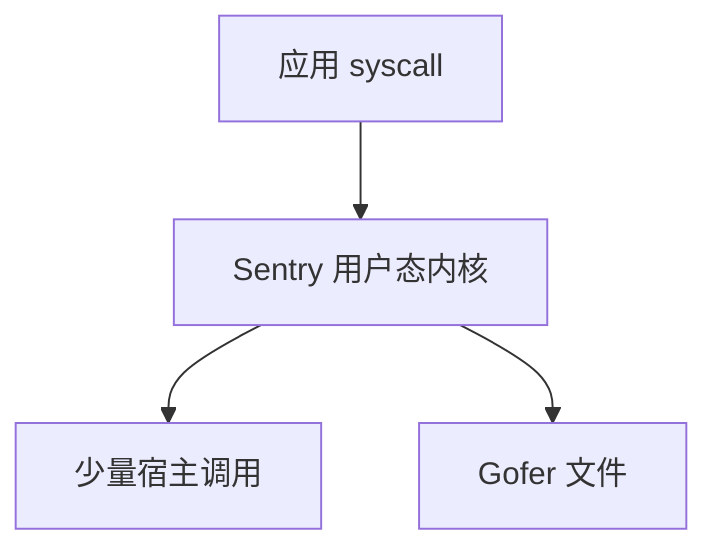

# gVisor

gVisor 的 Sentry 在用户态实现 Linux 系统调用：应用 ptrace 或 systrap 进入 Sentry，宿主内核看见的是 Sentry 的调用，而不是应用的。

<footer>—— 据 gVisor 文档；[seccomp]/ptrace 与 [FUSE](/cs/fuse) 为用户态代内核对照</footer>

[上一课](/cs/oci-image-layers)留下的缺口接到本课。 [runc](/cs/container-runtime) 把 syscall 直接给宿主。[KVM](/cs/kvm-qemu) 是另一极端。缺口是 **应用内核在用户态**：gVisor。

## 问题

Sentry 实现 VFS、net、mm 子集。Gofer 代文件。缺口：兼容性（不是每个 ioctl）；性能税；与 [LSM](/cs/lsm-selinux) 宿主仍包一层。本课不把 Sentry 内部写成 Go 课。

平台：ptrace 慢，KVM 平台用硬件隔离跑 Sentry。对象是缩减内核攻击面。

## 方法

应用 syscall → 陷入 Sentry → Sentry 用有限宿主 syscall 完成。对照 [FUSE](/cs/fuse)：文件可走 gofer。对照 [seccomp]：过滤 vs 重新实现。对照 [unikernel](/cs/unikernel) 后课：一个截 syscall，一个无 syscall。

## 机制

gVisor 把 Linux ABI 的实现从宿主内核挪到用户进程，使内核漏洞对应用更远。代价是慢与不全。不要写成「比 VM 安全」的绝对句。与 [eBPF](/cs/ebpf-observability)：观测要看 Sentry 不是宿主进程树直觉。

不支持的 syscall 会 ENOSYS，应用崩。

实现上：Sentry 的网络栈自己实现，和宿主 conntrack 不是一张表。ptrace 平台每个 syscall 两次陷入，KVM 平台用硬件隔离跑 Sentry。不支持的 ioctl 直接失败。 读法上只引用[上一课](/cs/oci-image-layers)的结论，不把对象换成训练推理或限价簿。

本课在操作系统进阶的「虚拟化与隔离进阶 / 容器与内核形态」课序里，对象是 **gVisor**。

- 先修只引用，不重导：上一课的结论当公理，本课只补差。
- 五栏不吞并：不把本课写成大模型训练/推理，也不写成限价簿或权重量化。
- 文献用 OSTEP、McKusick、内核文档与具名会议论文；不发明 arXiv 编号。

## 边界

本课不引入所有平台后端。不保证 GPU。下一课微型 VM：Firecracker。

版本字段会变，课序钉的是机制对象「gVisor」，不是某一主线内核的结构体名。
后课默认：可用用户态内核截 syscall。专用微型 VMM，下一课 Firecracker。

## 小结

- gVisor 用 Sentry 在用户态实现 Linux ABI。
- 减宿主内核暴露，付性能与兼容。
- Firecracker 是下一课。
- 出处：gVisor 文档；OCI；KVM 平台说明。
