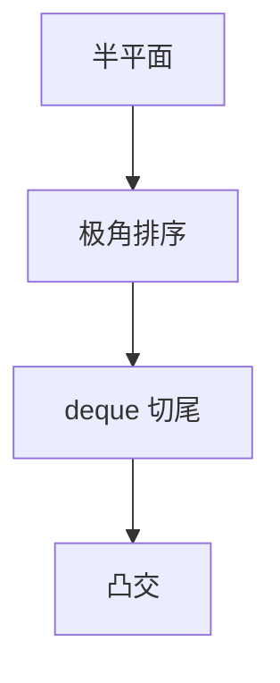

# 半平面交

线性不等式的可行域是凸多边形（可无界）；增量或极角排序 + 双端队列 $O(n\log n)$ 求出交。

<footer>—— 据 Preparata, Muller 与计算几何教材；LP 二维对照[单纯形](/cs/simplex) 整理</footer>

上一课[线段相交](/cs/segment-intersection)报交点。半平面 $ax+by\le c$ 的交是凸集。缺口是求交多边形：极角排序后 deque 增量，类似 Andrew 凸包对偶。不重写 BO。后课 Voronoi。二维 LP 也可随机增量线性期望。

## 问题

$n$ 个半平面，交可能空、点、多边形、无界。对偶：点凸包 $\leftrightarrow$ 半平面交。算法：排序方向，维护凸链，新半平面切掉尾部。$O(n\log n)$。

缺口是凸可行域边界，不是单纯形表（高维）。

### 无界要加哨兵

无穷射线用很大边界或方向无穷。空交要检测矛盾（平行反向）。不要假定一定有界。

计算几何教材半平面交。Megiddo/Seidel 二维 LP 线性。后课 Voronoi 可看成半平面交的轨迹。

## 方法

规范化（左侧为可行）。按法向极角排序。双端队列增量。输出顶点。

平行半平面先合并最紧。

## 机制

新约束只切凸多边形的连续一段，故从两端弹。与 Graham 对偶。与 LP：目标可当再一个扫描方向。高维半空间交是 $O(n^{\lfloor d/2\rfloor})$ 级，本课平面。

## 边界

本课不写三维多面体。浮点切点收到鲁棒性课。后课默认：平面半平面交 $O(n\log n)$。下一课 Voronoi 与 Delaunay。

## 小结

- 半平面交 = 凸多边形（可空、可无界）。
- 极角 + deque $O(n\log n)$。
- 对偶于点凸包。
- 出处：计算几何标准算法；二维 LP 对照。
