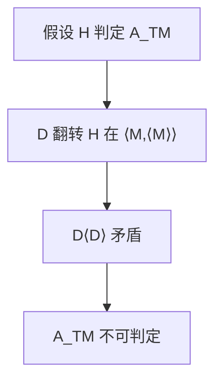

# 对角化与停机问题

<div class="epigraph">
<p>假定有判定机回答「$M$ 是否接受 $w$」，把它接到自己的编码上再翻转，就会矛盾；停机与接受一样不可判定。</p>
<footer>—— 据 Turing, 1936；Sipser 整理</footer>
</div>

上一课[可判定与可识别](/cs/decidable-recognizable)给出 $A_{\mathrm{TM}}$ 可识别，并留下是否可判定。缺口是**对角化**：通用机让 $\langle M\rangle$ 成为串，自指加翻转推出没有判定器。本课同时写下停机问题 $HALT$。

## 问题

假设 $H$ 判定 $A_{\mathrm{TM}}$。构造 $D(\langle M\rangle)$：跑 $H(\langle M,\langle M\rangle\rangle)$，若 $H$ 说接受则拒绝，否则接受。问 $D(\langle D\rangle)$：两种答案都反。故 $H$ 不存在。$A_{\mathrm{TM}}$ 仍可识别（模拟到接受为止），于是这是严格的 RE $\setminus$ 可判定。

停机 $HALT=\{\langle M,w\rangle\mid M$ 在 $w$ 上停\}$。若 $HALT$ 可判定，模拟到停再看是否接受，就判定了 $A_{\mathrm{TM}}$。故 $HALT$ 不可判定。识别 $HALT$：模拟，$M$ 停则接受。

### 对角化不是基数游戏的全部

$\Sigma^*$ 可数，语言不可数，故存在不可识别语言。对角化给出**具体**的不可判定语言，而且仍 RE。纯基数不给出 $A_{\mathrm{TM}}$。

<span class="marginnote"> Turing 1936 证明判定问题无解。课堂把接受问题与停机问题分成两个语言。Cantor 对角化是同一手法在 $\{0,1\}^{\mathbb{N}}$ 上；这里翻的是「第 $M$ 台机器在输入 $\langle M\rangle$ 上」。</span> 

## 方法

写清 $D$ 的构造与矛盾的两分支。强调 $H$ 必须总停，否则 $D$ 的「若」没有定义。识别器不能这样翻：否实例上循环，翻转无法在有限步完成。



不要把「程序员看不出来会不会停」当成证明：那是经验，对角化是存在性矛盾。

## 机制

通用模拟让机器空间可编码、可复制。后课映射归约把其他问题化到 $A_{\mathrm{TM}}$ 或 $HALT$，不必每次再造一个 $D$。本课只打两颗钉子。Rice 将把「语义性质」一批送走。

时间有限的截断不能判定停机：给不出对所有 $M,w$ 都够用的步数界。

<span class="marginnote">直觉类比：对角化是说谎者悖论的程序版。理发师「只给不自己刮脸的人刮脸」，那他给自己刮不刮？$D$ 问 $H$「这台机器会接受自己的编码吗」，然后专唱反调——无论 $H$ 答哪边都自相矛盾。</span>

<span class="marginnote">术语翻译：可识别 = 答案是「是」时，能在有限时间内看到「接受」；可判定 = 「是」「否」两种答案都能在有限时间内给出。$A_{\mathrm{TM}}$ 是前者的典型：拒绝实例可能永远跑不完，你等不到那个「否」。</span>

通用机 $U(\langle M,w\rangle)$ 模拟 $M$ 于 $w$，自身必须能编码。对角化攻击的是「判定一切机器」的 $H$，不是某一台具体程序——静态分析可以对子类停机。Busy Beaver 函数增长快过一切可计算函数，是同一不可判定性的定量版，本课不展开。

```mermaid
flowchart TD
  ASS["假设 HALT 可判定"] --> Q{"问 HALT：M 在 w 上停吗？"}
  Q -- "不停" --> NO["直接判拒绝"]
  Q -- "停" --> SIM["放权模拟 M 跑 w"]
  SIM --> R{"M 接受？"}
  R -- "是" --> ACC["判接受"]
  R -- "否" --> REJ["判拒绝"]
  ACC --gt CON["A_TM 变可判定"]
  NO --gt CON
  CON --gt CONTR2["与已证矛盾 ⇒ HALT 不可判定"]
```

<span class="marginnote">常见误区：初学者以为「等得够久」就能检测死循环——跑十分钟没停就当它不停。但不存在对所有程序都够用的等待时间：有的程序就是要在第十一个小时停。这正是「截断不能判定停机」的含义。</span>


## 边界

本课不证 Busy Beaver 不可计算，不引入神谕层级。不把停机写成「死循环检测工具做不到」的工程句——静态分析可以在子类上停，全类不行。后课默认：$A_{\mathrm{TM}}$、$HALT$ 不可判定、可识别。下一课映射归约传递不可判定性。

识别器不能对角翻转，因为否实例上可能循环，$D$ 的「否则接受」没有有限步定义。这正是可判定与可识别的差别变成具体语言 $A_{\mathrm{TM}}$ 的地方。

## 小结

- 对角化：翻转通用判定器，打掉 $A_{\mathrm{TM}}$。
- $HALT$ 与 $A_{\mathrm{TM}}$ 同样不可判定，仍可识别。
- 识别器无法同样翻转，因为可能循环。
- 出处：Turing, 1936；Sipser。
