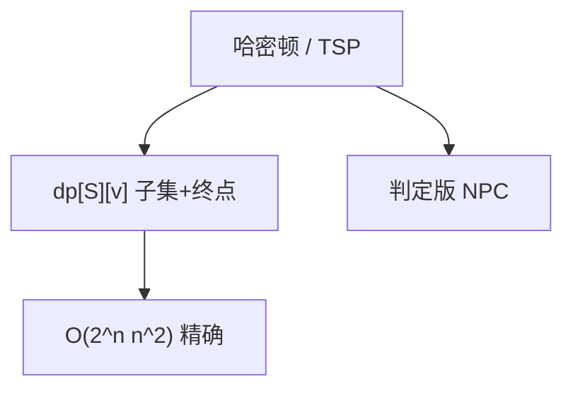

# 哈密顿与 TSP 精确解

点各走一次是 NPC；精确求解靠子集 DP：在已访问集合与当前点上转移，Held–Karp 把 $n!$ 降到 $O(2^n n^2)$。

<footer>—— 据 Held and Karp, A Dynamic Programming Approach to Sequencing Problems, 1962；Bellman, Dynamic Programming Treatment of the Travelling Salesman Problem, 1962；CLRS 第 34、35 章整理</footer>

上一课[欧拉回路](/cs/euler-circuit)在边上线性可解。本课换到**点各一次**：哈密顿路/回路，以及旅行商（TSP）的精确最优。不重写欧拉的度条件。缺口是：为何难，以及精确算法还能做什么——不是近似（Christofides 在后课近似单元）。主干[NPC 典型问题](/cs/npc-canonical)已点名哈密顿；本课把指数 DP 写清。

## 问题

哈密顿回路：简单圈过每个点。无向/有向都 NPC（Karps 清单）。TSP：完全图（或补 $\infty$）上求最短哈密顿回路。度量 TSP 仍 NPC，但有近似；本课要的是**精确值**。

枚举排列 $O(n!)$。Held–Karp / Bellman：$dp[S][v]=$ 从定点 $s$ 出发、走过集合 $S$、停在 $v$ 的最短路长，其中 $s\in S$、$v\in S$。转移：$dp[S][v]=\min_{u\in S\setminus\{v\}} dp[S\setminus\{v\}][u]+w(u,v)$。状态 $O(2^n n)$，转移 $O(n)$，总 $O(2^n n^2)$。回路再从各 $v$ 加 $w(v,s)$ 取最小。

缺口是这张表，不是再证 NPC。

### 指数仍可能比 $n!$ 可用

$n\le 20$ 量级常靠这张 DP；$n=40$ 要剪枝、分支定界或专门求解器。本课不把求解器当算法定义。不要对一般图声称多项式哈密顿——除非 P=NP。

Held–Karp 1962 与 Bellman 1962 独立给出 TSP 的子集 DP。Karp 1972 把哈密顿列入 21 题。后课 LCA 离开难解回路，进入树上的查询。

## 方法

定点 $s$。初始化 $dp[\{s\}][s]=0$。按 $|S|$ 升序填表。求回路时枚举回到 $s$ 的边。可记录前驱还原路径。空间 $O(2^n n)$ 可用滚动或哈希存可达子集，本课记标准界。

有向、无向同一骨架，边权可只取存在的边。

## 机制

最优子结构：最短 $(s,S,v)$ 路径的倒数第二点 $u$，前缀必须是最短 $(s,S\setminus\{v\},u)$——否则替换。这与[动态规划](/cs/dynamic-programming)的最优子结构同型，状态是子集不是前缀。欧拉没有这张表：边的状态可用度数局部检查。

分支定界用下界（MST、分配问题）剪掉排列树，最坏仍指数；与 DP 互补，本课点名。

## 边界

本课不写度量 3/2 近似，不写 Christofides。不引入代数方法（Koutsoupias 等之外的 Contour/Held–Karp 变体可点到：有随机多项式空间算法，不展开）。后课默认：哈密顿/TSP 精确 = 子集 DP 或指数搜索；判定 NPC。下一课树上最近公共祖先，图变树、查询变倍增。

## 小结

- 点各一次：判定 NPC；精确 TSP 用 Held–Karp。
- $O(2^n n^2)$ 不是多项式，但远好于 $n!$。
- 欧拉在边、哈密顿在点，不要混。
- 出处：Held and Karp, 1962；Bellman, 1962。
