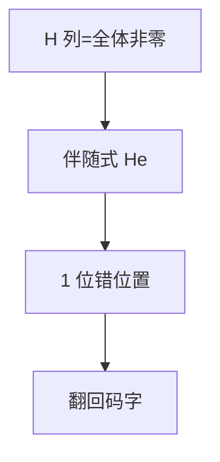

# 汉明码

校验矩阵的列是全部非零向量时，伴随式直接给出 1 位翻转的位置；$(2^m-1,2^m-1-m)$ 码完美，$d_{\min}=3$。

<footer>—— 据 Hamming, 1950；MacWilliams and Sloane 整理</footer>

上一课[信道容量](/cs/channel-capacity) 是存在性。[汉明距离](/cs/hamming-distance) 与纠错直觉课已经用 $(7,4)$ 当例子。缺口是把 **Hamming 码**写成线性码：生成、校验、伴随式译码，不再停在「相异位数」。

## 问题

线性码：$C=\ker H$。Hamming： $H$ 的列是 $\mathbb{F}_2^m\setminus\{0\}$ 各一次。长 $n=2^m-1$，冗余 $m$，维 $k=n-m$。任一重量 1 的错误向量 $e$，$He$ 等于 $H$ 的某列，即错误位置。$d_{\min}=3$（无重量 1、2 的码字），纠 1 位。球半径 1 填满空间：完美码。

$(7,4)$ 是 $m=3$。主干奇偶/CRC 是 $d=2$ 检错；这里 $d=3$ 纠错。

### 伴随式不是哈希

$He$ 是线性图像，为定位服务。密码学哈希不可逆；这里 $H$ 公开且故意可解 1 位错。

Hamming 1950。完美码稀少：Hamming、Golay 等。MacWilliams–Sloane 是编码圣经。本课不证 Hamming 界等式的全部组合。

## 方法

写 $m=3$ 的 $H$。编码：信息位乘 $G$（$H$ 的正交补）。译码：算伴随式，翻对应位，或为零则无错。两位错会误纠——容量课的 $f$ 大时 Hamming 不够，要后课更强码。

## 机制

线性使译码成矩阵乘，硬件友好。速率 $(n-m)/n\to 1$，但只纠 1 位，$n$ 大时对 BSC 的 $f$ 固定会失败——达不到容量。本课是构造的第一颗钉，不是容量达成者。

扩展 Hamming 加总偶校验，$d=4$，可纠 1 检 2。

对偶：Hamming 的对偶是单纯码，本课不展开。扩展 Hamming $(8,4)$ 在计算机内存 ECC 常见。两位错的伴随式非零且不等于任何列，若再加总校验可检出「双错」而不误纠。$n$ 增大只纠 1 位时，BSC 上块错误率上升，故它不是容量码。

## 边界

本课不引入循环码的多项式观点（CRC 主干已有检错多项式）。Reed–Solomon 是更大字母表，下一课。后课默认：二元完美 1 纠错码即 Hamming 族。下一课 RS。

伴随式定位依赖列集合是全部非零向量：这是完美 1 纠错的组合来源。两位错会映射到错误的列，故 $f$ 不小时要换码。线性译码是矩阵乘，不是哈希。

上一课留下的缺口在本课收口；「汉明码」进入后课词汇表后只引用。文献用来钉对象与边界，不把本课写成该主题的独立综述。

## 小结

- Hamming：$H$ 列穷尽非零，伴随式定位 1 位错。
- $d_{\min}=3$，完美；速率高但不抗许多错。
- 线性码译码 = 乘 $H$。
- 出处：Hamming, 1950；MacWilliams and Sloane。
