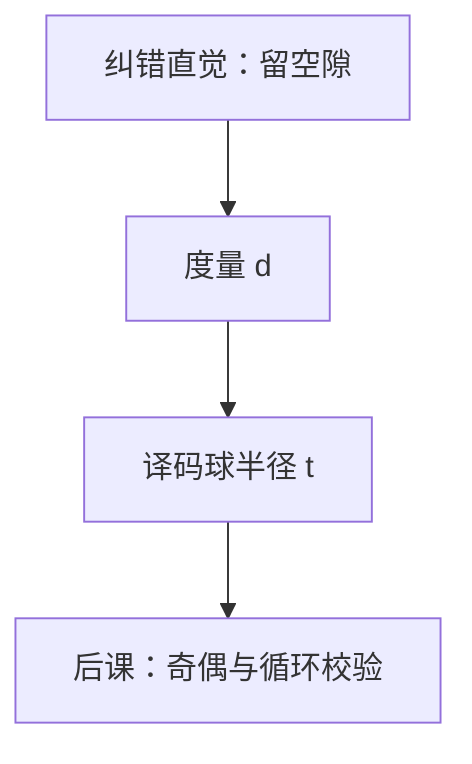

# 汉明距离

两个等长串的距离，就是相异位数；码的能耐，首先是最近的两个合法字隔开多远。

<footer>—— 据 Hamming, Error Detecting and Error Correcting Codes, 1950 整理</footer>

上一课[纠错码直觉](/cs/error-correcting-intuition)已经用「相异位数」和 $d_{\min}$ 说明检、纠半径，并把奇偶、Hamming $(7,4)$ 当例子。本课不重讲「为何留空隙」，也不从 Shannon 容量另起。缺口是：距离还只是直觉。后课奇偶与 CRC 要在这把尺子上算，必须把它写成**度量**，并问球能装多满。

## 问题

记 $d(u,v)$ 为 $u,v\in\Sigma^n$ 上取值不同的坐标个数。上一课用它定义 $d_{\min}$。缺口因此不是新的熵，而是确认：$d$ 满足正定、对称、三角不等式，从而最近邻译码「球半径 $t$、要求 $2t+1\le d_{\min}$」有几何意义。重量 $w(u)=d(u,0)$，线性码里距离由重量决定——线性结构下一课多项式校验才用上，本课先承认这一句。

Hamming 界：半径 $t$ 的球体积 $\sum_{i=0}^{t}\binom{n}{i}$ 乘 $|C|$ 不超过 $2^n$。本课只钉这个计数上界；$\binom{n}{i}$ 的系统计数在更后的[组合计数](/cs/counting-combinatorics)才展开，这里当球内点数用。

### 距离不是熵

上一课[互信息](/cs/mutual-information)管平均不确定度。$d$ 不管 $p$：最坏情况下翻 $t$ 位是否仍落在正确译码球里。把误码率当成 $d_{\min}$，会把几何与概率再搅回去。

Hamming 1950 同时给出距离、$(7,4)$ 码与奇偶校验思想。三角不等式保证「走两步」不会比直达更近到自相矛盾；译码球因此最多两两不交。

## 方法

验证度量公理（三角：翻到中间再翻到终点，翻转次数可加）。码 $C$ 的 $d_{\min}=\min_{c\neq c'}d(c,c')$。检 $d_{\min}-1$ 位错、纠 $\lfloor(d_{\min}-1)/2\rfloor$ 位错。重复码、偶校验（$d_{\min}=2$）、Hamming 码（$d_{\min}=3$）是同一把尺子上的三个刻度。

## 机制

存储 ECC、总线奇偶，硬件上是按位异或累加——实现是后课布尔与门。本课只规定：校验位的作用是把 $d_{\min}$ 抬上去。最短路、编辑距离是另一类度量，对象不是固定长度比特翻；不要把 Levenshtein 提前塞进 Hamming。

## 边界

本课不构造生成矩阵，不证明 Hamming 码完美（球填满空间）。Reed–Solomon 的符号距离不是比特汉明距离，后课存储阵列若用它，须换字母表。主动篡改不是独立翻转，完整性用 MAC，不是 $d_{\min}$。

后课默认：检错纠错先问 $d_{\min}$；奇偶是 $d=2$ 的特例，CRC 是同一尺子上的多项式做法。

## 小结

- 汉明距离是相异位数，构成度量；$d_{\min}$ 决定检、纠半径。
- Hamming 界用球体积限制码大小。
- 几何与熵分工：本课只管最坏翻转。
- 出处：Hamming, *Error Detecting and Error Correcting Codes*, 1950。
