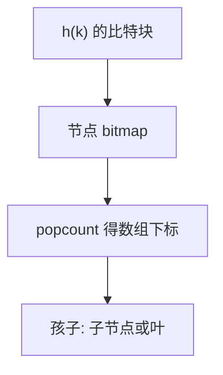

# HAMT

用哈希的若干比特当路径，节点用位图压缩孩子数组；持久更新只复制路径，未改的分支共享。

<footer>—— 据 Bagwell, Ideal Hash Trees, 2001；Okasaki, Purely Functional Data Structures 整理</footer>

[上一课](/cs/rope-structure) 按位置分裂。[Trie](/cs/trie) 按键字符，哈希键则路径均匀。[可持久化线段树](/cs/persistent-segment-tree) 的路径复制在此换成哈希前缀。本课不拼接字符串。缺口是 Hash Array Mapped Trie：函数式字典的主流表示（Clojure、Scala 等）。

## 问题

持久 `map`：每次插入若拷全表 $\Theta(n)$。HAMT：哈希 $h(k)$ 从高到低每次取 $b$ 比特（常 5，扇出 32）。节点：`bitmap` 标明哪些槽非空，`array` 只存存在的孩子，popcount 算下标。冲突：最终叶子链或再哈希。缺口是**用位图压缩稀疏的 $2^b$ 叉 trie**，使内部节点小、路径 $O(w/b)$。

Bagwell 2001 技术报告 *Ideal Hash Trees*。Okasaki 讨论持久树共享。本课不把 JVM 实现细节当理论。

## 方法

查找：沿比特选孩子，位图测试该比特。插入：路径复制，改一个孩子槽；若叶冲突则加一层。删除对称，可收缩。并发：可与 CAS 根指针结合（后课），本课先单线程持久。

与链式哈希表：HAMT 保持久共享、无扩容抖动；常数通常更大。与 ART：下一课自适应基数树按真实键字节、面向内存数据库，节点类型可变。

## 机制

空间：节点只分配非空孩子。缓存：数组小而密，好于指针 256 叉。哈希仍要抗碰撞；HAMT 不消除[散列碰撞](/cs/hash-collision) 语义，只是把链改成更深路径。

不要把 HAMT 当神经网络权重存储课——本栏是 CS 字典结构。

## 边界

本课不写 CHAMP 等全部变体。有序遍历不是 HAMT 强项（无序哈希）。按字节自适应扇出是 ART。

后课默认：持久无序映射可用 HAMT。内存有序/字节键高扇出用 ART。

## 小结

- HAMT：哈希比特 trie + 位图压缩数组，路径复制。
- 扇出常 32；持久共享未改分支。
- 下一课 ART 按键字节自适应节点。
- 出处：Bagwell, 2001；Okasaki。
