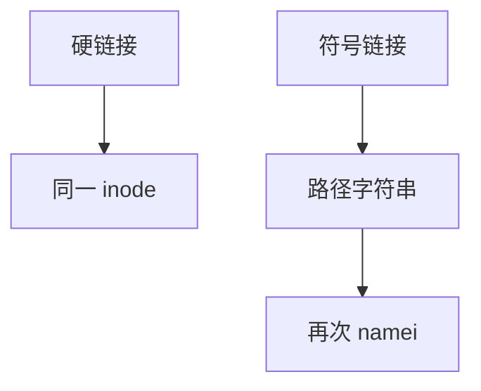

# 硬链接与符号链接

硬链接是多条目录项共享同一 inode；符号链接是存路径的小文件，查找时再进入 namei。

<footer>—— 据 Thompson, UNIX Implementation；Bach；POSIX 对 symlink 的整理</footer>

[上一课](/cs/path-lookup)按分量走树。[inode 与目录](/cs/inode-dir)已点到链接计数。缺口是把两种「多名」收成语义：硬链接不跨文件系统、对着 inode；符号链接跨文件系统、对着字符串，并有环与权限的不同规则。下一课 [VFS](/cs/vfs) 要用统一操作表实现它们。

## 问题

用户希望「两个名字同一份数据」或「快捷方式指向另一路径」。若只有硬链接，挂载点对面无法指过去，目录硬链接还会制造「..」环。若只有符号链接，每次打开都依赖目标仍存在，且要决定跟随几次。缺口：`link` 增加 nlink；`symlink` 创建类型为链接的 inode，内容是路径字节；查找时对符号链接再解析，对硬链接已经在同一 inode 上结束。

本课不把 `readlink` 的全部旗标写完。

目录通常禁止硬链接（除 `.` `..`）。符号链接自身的权限往往不参与末节点访问，中间目录仍要搜权。环用跳数上限切断。

## 方法

硬链接：同一设备上新目录项写入已有 inode 号，nlink++。删除名字 `unlink` 减计数，到零且无打开者才回收块。符号链接：lookup 得到链接 inode，把内容当新路径（相对则相对链接所在目录）继续 [路径查找](/cs/path-lookup)。`lstat` / `O_NOFOLLOW` 让调用者停在链接上。打开跟随链接时，末节点权限看目标 inode。

## 机制

硬链接保证「改一个名字看见的数据，另一个名字也看见」，因为没有第二份 inode。符号链接是晚绑定：目标可断（dangling），备份与跨卷引用靠它。dcache 可以缓存链接 inode，跟随仍可能未命中目标侧。不要把链接写成攻击载荷构造；只说明解析规则。

与数据库外键无关。本栏不把关系完整性请进来。

## 边界

本课不引入 NTFS 交接点的对照表。不保证所有 FS 支持硬链接。下一课要把「目录、链接、设备、管道」收进同一套 inode 操作，让 `open` 不再写满分支。

后课默认：两种链接语义已定。多种文件系统如何共用 `read`/`lookup`，下一课虚拟文件系统。

## 小结

- 硬链接共享 inode 与 nlink；符号链接再走路径字符串。
- 目录硬链接默认禁止，防环。
- 统一操作表是 VFS 的缺口。
- 出处：Thompson, UNIX Implementation；Bach, *UNIX*；POSIX。
