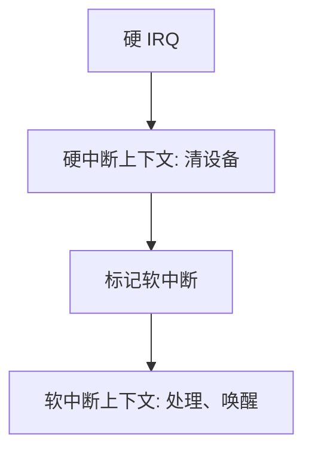

# 硬中断与软中断

硬中断上下文不能睡眠；软中断在开中断之后跑，仍不许睡眠，只是把可推迟的工作从 IRQ 线的关掩码下挪出来。

<footer>—— 据 Bovet and Cesati, Understanding the Linux Kernel；Love, Linux Kernel Development 整理</footer>

[上一课](/cs/interrupt-bottom-half)把设备 IRQ 拆成短上半与可推迟下半，但把 Linux 里「硬中断 / 软中断」两种**上下文**留白。缺口是：上半部对应硬 IRQ——可能关该线甚至关本地中断；下半部里有一类仍在中断返回前、以软中断形式跑，**仍然不能睡眠**，只是不再占用那条硬 IRQ 的关掩码。本课钉这两种上下文，不把 tasklet 队列写完。

## 问题

若凡下半部都可以睡，网卡收包处理会去拿睡眠锁、去调页，硬中断延迟的上界就丢了。若凡下半部都关硬中断，其他设备会被一次协议处理饿死。缺口不是再讲[异常入口](/cs/exception-interrupt-entry)，而是承认内核里至少两档：硬中断上下文（ISR）、软中断上下文（开硬中断、禁睡眠）。工作线程是第三档，下一课才请出来。

软中断按类型串行或分 CPU 串行，避免同一软中断在多核上重入同一全局结构。本课只要求「能推迟、仍不能睡」，不写编号表。

## 方法

硬 IRQ：应答设备、清原因、把描述符链入队列、标记对应软中断 pending，尽快 `iret` 路径。返回用户或返回内核前，若 pending，关抢占、开硬中断，跑软中断：组包、提交套接字缓冲、`wakeup` 阻塞在[系统调用路径](/cs/syscall-path)上的线程。软中断里禁止 `schedule` 进入睡眠。

与用户路径的会合点仍是等待队列：调用在路径里睡，软中断里唤醒。本课不写队列 API。

## 机制

两档让延迟分层：硬中断延迟由 ISR 长度决定；软中断延迟还叠加在返回路径上，但其他硬 IRQ 可以插进来。共享数据因此要分清「与硬 IRQ 并发」还是「只与软中断并发」——锁与关中断的搭配是后课，本课只预告：硬 IRQ 里不能拿睡眠锁。

[I/O 与 DMA](/cs/io-dma) 仍只提供完成通知；本课不重讲总线。

## 边界

本课不把 `BH` 历史名与 `softirq` 逐一对照成考古。NMI 几乎不能进这套推迟，后面单独一课。也不把用户信号当软中断：信号是进程的软件中断，对象不同。

后课默认：下半部里仍有不能睡的一档。更重、允许睡眠的推迟要交给专门机制，下一课讲 tasklet 与 workqueue。

## 小结

- 硬中断短、可关线；软中断可推迟但仍不能睡眠。
- 唤醒阻塞系统调用发生在软中断或更后的线程里。
- 可睡的推迟队列是下一课。
- 出处：Bovet and Cesati；Love, *LKD*。
