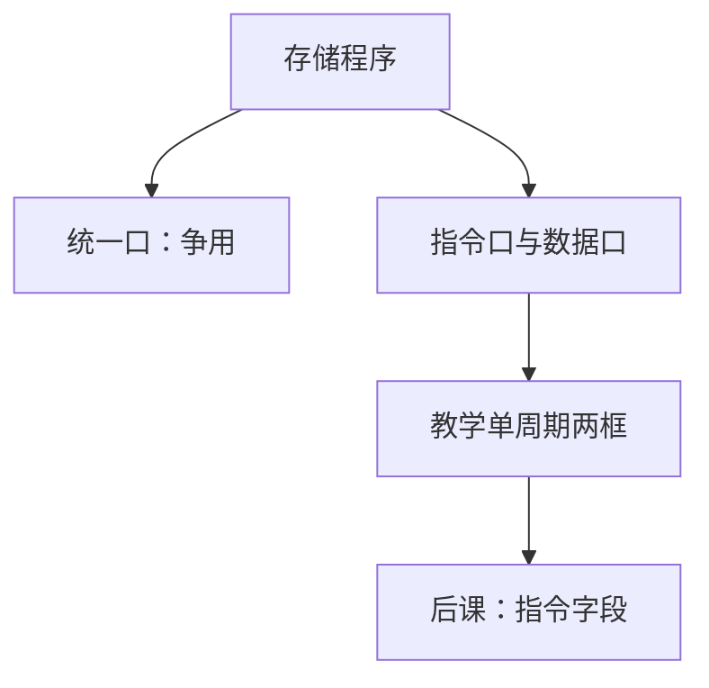

# 哈佛与冯·诺依曼

程序都是存储器里的指令；差别在取指与访数是否抢同一套口。冯·诺依曼共用，哈佛分开，仍是存储程序。

<footer>—— 据 Patterson and Hennessy, Computer Organization and Design (RISC-V)；von Neumann, First Draft of a Report on the EDVAC, 1945 整理</footer>

上一课[存储程序](/cs/stored-program)钉死了指令编码成比特、PC 去取。它已点名哈佛与冯·诺依曼差在端口。本课不重讲 PC 初值，也不从操作系统进程另起。缺口是把**两个口还是一个口**写成组成选择：后课单周期图常画分开的指令存储器与数据存储器，那是哈佛式教学模型。

## 问题

冯·诺依曼：同一可寻址空间、同一套总线，取指与 `lw`/`sw` 争带宽——瓶颈。哈佛：指令口与数据口并行，允许一拍同时取指与访存。缺口不是「程序是否在内存」，而是端口与地址空间是否统一。

现代 CPU：程序员看见统一虚址（冯·诺依曼），片上 I-cache 与 D-cache 分开（哈佛微结构）。MCU 常真哈佛。本课钉这一层对照，不把 Cache 一致性提前。

### 哈佛不是「不能当数据读指令」

分开的是口。若指令阵列可写，仍能自修改，只是走另一端口或经同步。RISC-V 教学默认不要靠自修改；`fence.i` 很后。把哈佛理解成「指令不是比特」，会与上一课冲突。

Patterson/Hennessy 单周期用两个存储器方框，避免一拍双端口冲突。EDVAC 草案是统一存储。本课不把哈佛大学标记指令格式当内容。

## 方法

画两种：共用存储器与 MUX 的取指/访数；双端口或两片阵列。单周期若坚持冯·诺依曼单口，取指与 `lw` 无法同拍，必须多周期或牺牲 $T$。

## 机制

后课指令格式切的是取出来的字，与口无关。总线课会再把「口」收成系统总线或交叉开关。组成主干：看见两个方框时，想到的是哈佛端口，不是两个 ISA。

## 边界

本课不讲修改代码的安全含义、不把 Harvard architecture 的历史机型清单列完。不讨论 GPU 的分离存储。

后课默认：程序仍是内存中的指令比特；教学数据通路可以指令/数据分口。下一课按 RISC-V 切 32 位字段。

## 小结

- 存储程序共通；哈佛/冯·诺依曼差在端口与争用。
- 程序员模型常统一空间，微结构可分 I/D。
- 指令仍是比特，下一课切字段。
- 出处：Patterson and Hennessy, COD (RISC-V)；von Neumann, EDVAC 草案, 1945。
