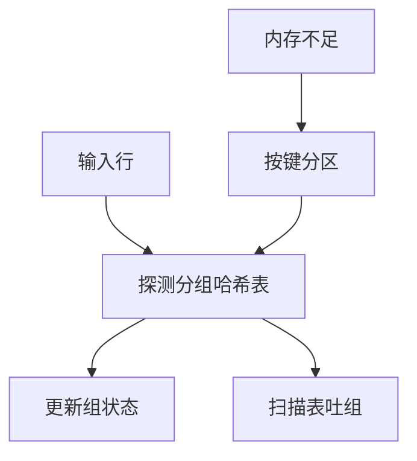

# 哈希聚合

按分组键散到桶，组状态留在表项里；内存够则一次扫描，不够则分区再递归，形状对齐哈希连接。

<footer>—— 据 Graefe 聚合方法；Ramakrishnan and Gehrke；GROUP BY 语义课的物理实现</footer>

[上一课](/cs/external-sort)用排序做阻塞有序输出。本课不造 run。缺口是 [GROUP BY](/cs/sql-aggregation) 的常用物理：哈希聚合。等值分组不必全序；排序聚合在要顺串或组数极大、内存极小且键已有序时仍有地位。

## 问题

扫描一行，用分组键探测哈希表：命中则更新 `SUM`/`COUNT` 状态，未命中则插入新组。结束时扫描哈希表吐结果（无序，除非再排）。缺口是内存：组数 ≈ NDV(分组键)。估小了表膨胀，必须溢出到分区（与 Grace 哈希连接同一思想）：按键高位划分，各分区分别聚合再并。

倾斜：单组极大（所有行同一键）哈希帮不上分区——该组状态仍可能很小（一个合计），行仍要扫完。倾斜伤的是连接探测，聚合里伤的是「热组」更新争用（并行时）。

两阶段聚合：先线程局部聚合，再全局合并，减少锁。流式聚合与窗口不同：窗口不收缩。本课收缩成每组一行。

## 方法

内存哈希聚合；溢出则写分区文件，每分区再哈希或排序聚合。`DISTINCT` 聚合：组内再套集合或哈希集。`FILTER` 在更新状态前判。空组规则在语义课已钉，执行器对无 `GROUP BY` 的裸聚合要在空输入时仍吐一行。

与向量化：按批探测，用选择向量。编译：生成针对具体聚合函数的更新代码。

## 机制

基数估计决定选哈希还是排序：估 NDV 过低会选哈希然后溢盘，可能比一开始排序更差——估计误差课的实例。计划回归可表现为聚合算子种类切换。

并行：local agg + exchange 按组键重分区 + global agg。exchange 下一课之后；本课单机内存模型。

## 边界

本课不写 Grace hash join 的探测侧细节——下一课专讲连接。聚合没有 probe 输入，只有一组输入。窗口函数不是哈希聚合。

后课默认：等值 `GROUP BY` 默认哈希聚合，溢盘分区；要有序输出再加排序。Grace 连接把「分区再处理」用在两输入上。

哈希表的组状态大小计入内存预算，不只是键。

## 小结

- 哈希聚合一次扫描更新组状态；组 NDV 决定能否驻留。
- 溢出分区与哈希连接同源；空输入裸聚合仍要吐行。
- Grace hash join 下一课：两输入的分区哈希连接。
- 出处：Graefe；Ramakrishnan and Gehrke；聚合语义对照。
