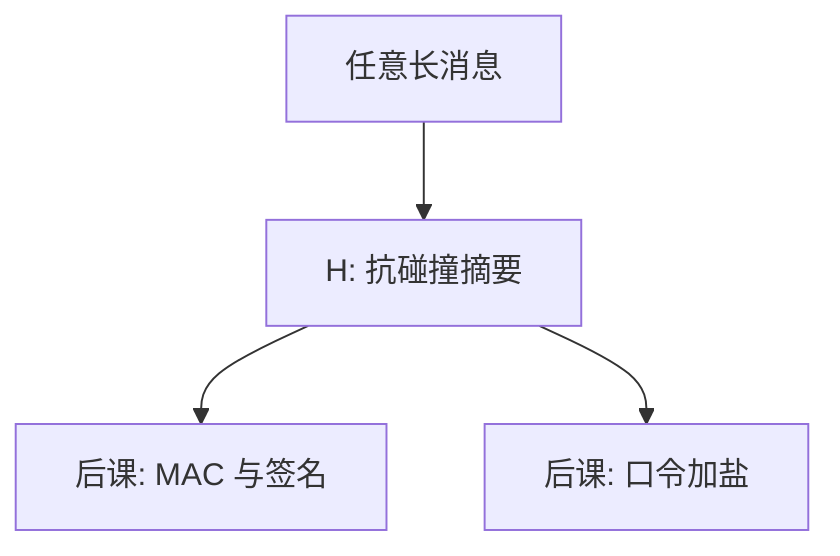

# 哈希与碰撞

压缩任意长输入到固定摘要；有用的是碰撞难找，不是「摘要看起来随机」这一句。

<footer>—— 据 Damgård 对哈希设计；Stallings 对原像与碰撞的整理</footer>

[上一课](/cs/dh-vs-rsa)用公钥运会话键。本课不重做 DH。缺口是：签名、MAC、口令存储、承诺都要把「大消息」收成固定串，并希望找不到两个输入同一摘要。[数据结构](/cs/hash-function)的散列要快、要均匀；本课的密码学哈希还要**原像难、第二原像难、碰撞难**。

## 问题

索引哈希可以故意设计成简单取模。若敌手能找到 $x\neq y$、$H(x)=H(y)$，签名可被挪到另一份文件上，第二原像则让给定消息被顶替。缺口不是再讲链地址，而是这三条性质的强弱：碰撞最容易（生日界），原像最难。MD5、SHA-1 的碰撞已在密码分析里垮掉，主干用它们当反例，不用当机制。

生日界：约 $2^{n/2}$ 次评估可望找到碰撞。$n=256$ 时该数仍大；$n=128$ 的碰撞安全边际按今天的标准不够当签名哈希。

## 方法

密码学哈希：公开、确定性、固定输出。Merkle–Damgård 把压缩函数迭代；海绵结构（SHA-3）是另一族。本课不证随机预言机，只要求后课把 $H$ 当「除穷举与生日外不会被操纵」的零件——并且知道现实哈希会破，要能换。

## 机制

签名对摘要签，不对流式明文逐比特做昂贵公钥运算。完整性可以先哈希再加密，但正确组合仍是 AEAD 或 Encrypt-then-MAC。口令存哈希而不是明文，下一课还要加盐与慢哈希，本课只把「单向压缩」交出去。

长度扩展：某些 MD 构造下，知道 $H(m)$ 可伪造 $H(m\|pad\|\mathit{suffix})$ 而不知 $m$。这是后课 MAC 不用「裸哈希当认证」的原因之一。

第二原像难于碰撞：给定 $m$ 再找 $m'$ 比随便找一对更难，签名要的是这一层。

## 边界

不要把哈希当加密：摘要不是密文，通常可公开。也不要把「区块链」插入本栏。校验和、CRC 防随机噪声，不防敌手，那是[纠错码](/cs/error-correcting-intuition)的亲戚，不是本课。

文件完整性可以公开贴 $H(m)$，前提是获取摘要的通道本身完整；否则敌手同时换文件与摘要。后课默认：谈到摘要，默认抗碰撞密码学哈希；认证要 MAC 或签名，不是把 $H$ 公开贴上去。

换哈希算法是协议版本问题。主干只要求：摘要是可替换零件，破掉的函数退出实现，不改 MAC/签名的接口。

## 小结
- 长度扩展说明裸哈希不当 MAC；下一课 HMAC 与签名分开这层误用。
- 破掉的 MD5/SHA-1 当反例，不当现行机制。

- 公钥信封已在；本课交出抗碰撞摘要，并分清原像与碰撞。
- 生日界决定摘要长度；破掉的算法当反例。
- 用摘要做认证与不可否认，是 MAC 与签名课。
- 出处：Damgård；Stallings；对照 SHA-2/SHA-3 作为现行族的名字。
