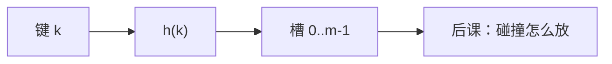

# 散列函数

把键均匀打进 $m$ 个槽，期望链长才短；函数本身必须是确定的计算，不能把碰撞假装成零。

<footer>—— 据 Knuth, The Art of Computer Programming 卷 3；Cormen, Leiserson, Rivest and Stein 整理</footer>

[上一课](/cs/dary-heap)解决了「只要最小」。字典若既不要序也不要最小，树的 $\Theta(\log n)$ 比较仍嫌多。[数组与随机访问](/cs/array-random-access)在键恰好是 $0..m-1$ 时已是 $O(1)$。本课不重讲堆序。缺口是：任意键先映射到槽下标 $h(k)\in\{0,\ldots,m-1\}$，期望下每次访问常数槽。碰撞不可避免，怎么处理是下一课；本课只钉函数该满足什么。

## 问题

若 $h$ 把所有键打到同一槽，后面的链表或探测都救不了。缺口不是再买一棵红黑树，而是**$h$ 应接近均匀**，且对同一键稳定（查找与插入用同一个 $h$）。简单取模 $k \bmod m$ 在 $m$ 与键的模式相关时会偏；乘法散列、全域族用来陈述「对任意键集，随机选 $h$ 则期望碰撞受控」。

本课不把密码学抗碰撞当成字典需求。那是安全栏的哈希；这里只要分布与速度。

鸽笼原理：键多于 $m$ 必有碰撞。好的 $h$ 不消除碰撞，只让碰撞像随机。 

## 方法

表大小 $m$，通常取素数或 2 的幂（后者用位运算）。除法散列：$h(k)=k \bmod m$。乘法：$h(k)=\lfloor m(kA \bmod 1)\rfloor$。全域散列：从函数族均匀抽 $h$，对任意不同 $k,k'$，$\Pr[h(k)=h(k')]\le 1/m$。

负载因子 $\alpha=n/m$。期望分析以 $\alpha$ 为参数。$\alpha$ 过大则再散列：新 $m$、新 $h$、全部重插，摊还与动态数组同类。

## 机制

有了 $h$，字典操作的期望时间变成「算 $h$ + 处理该槽的碰撞」。最坏仍是全部撞车 $\Theta(n)$，敌手可选键；随机 $h$ 或加盐让敌手难瞄准。合同必须写期望还是最坏——有序树给最坏对数，散列给期望常数。

$h$ 要快：键是字符串则应吃[局部性原理](/cs/locality-principle)顺序扫字节，不要每字符一次远程访存。$h$ 也不应是恒等：那会把连续键打进连续槽，对开放寻址的聚集尤其致命。

## 边界

本课不引入链与开放寻址的实现，不讨论完美散列。也不把 $h$ 写成加密哈希。字符串指纹、滚动哈希是算法课 KMP 之外的工具，此处不展开。

后课默认：$h$ 把键送到槽；同一槽多键是正常情况，要用链或探测。

## 小结

- 散列把任意键变成槽号；均匀性决定期望。
- 碰撞必有；全域族管期望，不管最坏敌手除非随机化。
- 链与开放寻址是下一课的两种放法。
- 密码学抗碰撞不是字典合同；这里只要分布与速度。
- 出处：Knuth, *TAOCP* 卷 3；Cormen et al. 第 11 章。
