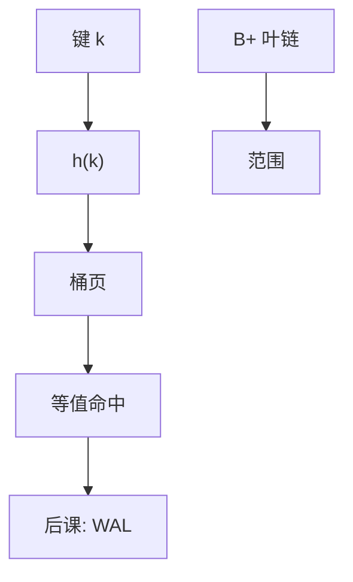

# 哈希索引

等值查找可以把键打散到桶；范围与有序扫描它给不了，那是 B+ 的工作。

<footer>—— 据 Fagin et al., Extendible Hashing, TODS 1979；Litwin 线性哈希整理</footer>

[上一课](/cs/bplus-split)把范围与有序交给 B+ 叶链。本课不重画叶分裂。缺口是：许多谓词是纯等值（主键点查、等值连接探针）。哈希桶把期望 I/O 压到接近常数，但丢掉序。[数据结构](/cs/hash-function)已有散列函数；这里要的是可增长的**磁盘桶**，不是内存一张表。

## 问题

B+ 点查仍走树高。哈希索引用 $h(k)$ 选桶页，桶内再找。缺口不是再讲链地址，而是外存上桶会满、目录会扩：可扩展哈希用目录倍增，线性哈希用渐进分裂。本课不把这两种目录结构证完，只锁定：等值 $O(1)$ 页级期望，范围查询不走它。

静态哈希在表增长后溢出链变长，退化为扫描。库用可扩展或线性哈希，使桶数随记录数长，而不是一次性定死桶数。

## 方法

可扩展哈希：目录是全局深度下的指针数组，桶有局部深度；满则分裂，必要时目录翻倍。线性哈希：按回合依次分裂桶，指针沿桶号走，避免一次翻倍。桶页仍是[槽化页](/cs/page-slot)。哈希连接用的内存表与本课磁盘索引同族不同场景：一个是算子工作区，一个是持久访问路径。

## 机制

等值连接的内层若有哈希索引，索引嵌套循环变成探针桶；这与一次性哈希连接（建临时表）互补。唯一性约束同样可落在哈希桶上，只是无法支持 `BETWEEN`。倾斜键把许多行打进同一桶，溢出链变长，估计里的「常数」被打穿——独立于 B+ 的倾斜（那是叶页热）。

本课不把布隆过滤器当索引：过滤器可判「一定不在」，不能给出 rid 列表。

## 边界

本课不讲一致性哈希做分布式分片，那是系统扩展，不是本课的页桶。也不把加密哈希（后课安全）与索引哈希混名：一个抗碰撞，一个要快、要均匀。崩溃后目录与桶页必须一起恢复，入口在下一课 WAL。

等值连接的选择率若高，哈希索引的「点查」会退化成扫很多溢出页，代价模型必须改用基数而不是「一次 I/O」。后课默认：等值可走哈希或 B+；有序、范围、排序只认 B+（或显式排序算子）。

桶目录本身也是页，会脏、要记日志。可增长哈希不是「无结构的数组」，崩溃与并发与 B+ 同一家族。

## 小结
- 范围、排序、`ORDER BY` 不走哈希桶；优化器若选错，是代价问题。
- 后课 WAL 对桶页与 B+ 页一视同仁：先日志后数据。

- B+ 管有序；本课用可增长哈希桶做等值访问路径。
- 磁盘哈希要处理分裂与目录，不是内存一张表。
- 页一改如何先记日志，是后课缺口。
- 出处：Fagin et al., 1979；Litwin, 1980；Ramakrishnan and Gehrke。
