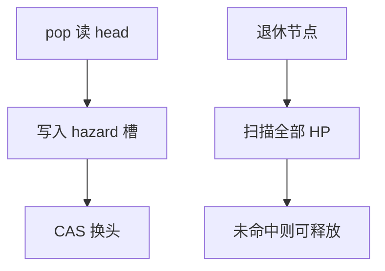

# 无锁栈与 hazard pointer

Treiber 栈用 CAS 换头，ABA 几乎是默认陷阱。Hazard pointer：读者先公布「我正抓着这些指针」，回收者跳过仍被抓的节点。

<footer>—— 据 Treiber, Systems Programming: Coping with Parallelism, IBM 1986；Michael, Hazard Pointers: Safe Memory Reclamation for Lock-Free Objects, IEEE TPDS 2004 整理</footer>

[上一课](/cs/michael-scott-queue) 留下节点何时 `free`。[无锁与 ABA](/cs/lockfree-aba) 已给现象。[RCU 宽限期](/cs/rcu-gp) 是另一回收。本课不重讲 dummy 节点。缺口是 Treiber 栈 + hazard pointer 回收合同。

## 问题

栈：`head` 指向单链。push：新节点 `next=head`，CAS `head`。pop：读 `h`，CAS `head` 到 `h->next`。ABA：pop 读 next 后，`h` 被弹出再压回，CAS 仍成功但 next 陈旧。hazard：线程进入临界前把指针写入 HP 槽并屏障，扫描时若节点出现在任一 HP 中则延后释放。缺口是**把「还在被读的地址」显式登记**，而不靠停全世界。

Treiber 1986 技术报告。Michael, *IEEE Trans. Parallel and Dist. Systems*, 2004（PODC 2004 前身）。epoch/QSBR 是批量版，RCU 课已见。

## 方法

每线程少量 HP 槽（栈 pop 常 1–2 个）。退休列表攒一批再扫描 HP。漏登记 = UAF；多登记只延迟回收。与带 tag 的双字 CAS：tag 防 ABA 但不防 UAF，常要两者或再加池。

与 MS 队列：同样需要 HP 或 epoch 保护 `head/tail/next`。与 RCU：RCU 读侧更轻、写侧等宽限期；HP 读侧要写槽。

## 机制

进度：扫描 HP 是回收者的活，读者无锁。槽要避免伪共享。本课不写攻击性 UAF exploit。并发哈希表下一课把桶锁或无锁探针对上字典，不是栈。

## 边界

本课不把所有 SMR（EBR、HE、PEBR）列成百科。实时最坏扫描 HP 与线程数有关。有序/无序字典的并发下一课。

后课默认：无锁链表回收用 HP 或 epoch。并发映射用分段锁或无锁桶。

## 小结

- Treiber 栈：CAS 头；ABA 与回收绑定。
- Hazard pointer：公布指针，退休时扫描。
- 下一课并发哈希表。
- 出处：Treiber, 1986；Michael, *TPDS*, 2004。
