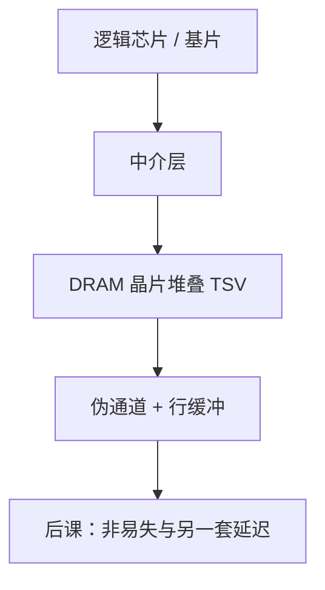

# HBM 与 3D 堆叠

  
把 DRAM 晶片叠在逻辑基片上，用硅通孔做很宽很短的通道：带宽上来，容量与热仍受堆叠层数限制。

  <footer>—— 据 JEDEC HBM 标准；Hennessy and Patterson, CA:AQA 整理</footer>

[上一课](/cs/fr-fcfs)的调度在离芯片 DIMM 通道上跑，引脚数限制宽度。缺口是 **HBM**：3D 堆叠 DRAM + 宽 I/O，组织仍是通道/伪通道/bank/行，物理从 PCB 金手指换成中介层与 TSV。

## 问题

DDR DIMM：板级走线、几十比特宽、GHz 级。HBM：每堆叠多个伪通道，数据宽度一个数量级以上，时钟可以更保守，靠并行取带宽。缺口不是新的行缓冲定义，而是**封装层次**改变通道数量与功耗分布：PHY 在中介层旁，控制器仍做 ACT/RD 与刷新。

3D 堆叠：TSV 连多层 DRAM 晶片。热从逻辑芯片和 DRAM 自刷新一起来，功耗墙在垂直方向更紧。

### HBM 不是「把 cache 做进 DRAM 工艺」

HBM 仍是 DRAM 电容，要刷新、有行缓冲。逻辑基片可以含控制器，不把 HBM 变成 SRAM 缓存。把 HBM 当片上 SRAM，一致性与保留时间会说错。也不等于 NAND 闪存堆叠（后课）。

JEDEC HBM/HBM2/HBM3 规范定义接口。CA:AQA 用 3D 与宽 I/O 讲带宽。本课不写 TSV 光刻工艺，不把 GPU 型号当标准。

## 方法

地址映射切到更多伪通道。调度器实例变多，每伪通道仍可 FR-FCFS。容量：层数 × 密度，不及多 DIMM 服务器容量时用 DDR 做远端、HBM 做近端（异构内存），OS 可见性后课 NVM 再对照。

训练与校准仍在，只是通道极多，PHY 数字控制更重。

## 机制

软错误：堆叠与 TSV 不取消 ECC。老化：热点在中心层。经济学：中介层与堆叠良率提高 NRE，故出现在带宽关键的加速器，而不是每块 PC 主板。后课闪存是另一介质，不要把「堆叠」三字共用成同一课。

## 边界

本课不讲混合键合的全部工艺选项，不进入光刻套准。不把 HBM 带宽写成大模型必修——系统栏只给接口。不讨论显卡零售。

后课默认：HBM 是宽而短的 DRAM 通道加 3D 堆叠；命令语义仍是 DRAM。

## 小结

- 宽伪通道 + TSV 堆叠拉带宽；仍是 DRAM 行缓冲与刷新。
- 热与良率限制层数与谁用得起。
- 下一课介质换成非易失。
- 出处：JEDEC HBM；Hennessy and Patterson, CA:AQA。
