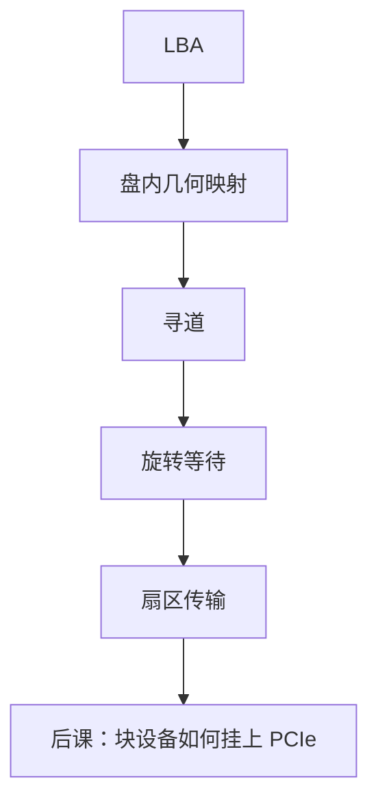

# 磁盘几何与寻道

  
磁头要移动到目标磁道再等扇区转过来：机械延迟按毫秒计，地址在固件里从 CHS 改写成 LBA，操作系统看见的仍是块。

  <footer>—— 据 Patterson and Hennessy, Computer Organization and Design (RISC-V)；Hennessy and Patterson, CA:AQA；Tanenbaum and Bos, Modern Operating Systems 整理</footer>

[上一课](/cs/ssd-gc-wear)的 SSD 没有寻道。[磁盘调度](/cs/disk-sched)在 OS 课可能已谈电梯算法。缺口是硬件几何：**柱面/磁头/扇区**、寻道与旋转，以及为何今天仍要懂它——因为 HDD 还在冷数据层，且对照让 SSD 的并行更清楚。

## 问题

盘片旋转，磁头臂径向移动。访问时间 ≈ 寻道 + 旋转等待 + 传输。外圈比特密度更高（ZBR），同角度扇区更多。缺口不是 FTL，而是：控制器把 LBA 映到物理扇区，坏扇区重映射（比 NAND 简单的替代区）。顺序大块传输摊薄寻道；随机 4K 被机械支配。

缓存：盘内 DRAM 缓冲写，掉电风险类似未持久的写回。

### LBA 不是「没有几何了」

主机接口放弃 CHS 编程，几何仍在盘内决定延迟。把 HDD 当均匀延迟块设备，调度器无法解释为何顺序快两个数量级。也不要把寻道当 PCIe 的 lane 训练。

Patterson/Hennessy 与 CA:AQA 用磁盘讲存储层次底部。Tanenbaum 有 CHS 与调度。本课不背某 RPM 型号。

## 方法

固件：逻辑地址 → 物理磁道/头/扇区，避开缺陷表。命令队列（NCQ）让盘内选最近扇区，类似 FR-FCFS 但对旋转位置。与 SSD：无擦除、可覆盖，无磨损均衡，有机械磨损（另一统计）。

RAID 与文件系统布局（柱面对齐）是上层；本课只交延迟来源。

## 机制

下一课 PCIe 是互连，NVMe SSD 与部分 HDD 桥都坐在它上面。本课把「块设备内部」从闪存与磁盘两边讲完，接口层开始。DMA 稍后把块搬进内存，不经过 CPU 逐字拷。

## 边界

本课不讲磁记录物理（垂直记录、HAMR）的材料细节，不进入光刻。不把磁带库几何写进主干。不讨论交易所托管机房的磁盘——本栏禁限价簿。

后课默认：HDD 延迟由寻道与旋转主导；对外仍是 LBA 块。

## 小结

- 寻道+旋转是毫秒级；ZBR 让外圈更快。
- 主机用 LBA；几何在固件。
- 对照 SSD：可覆盖、无 GC，但有机械。
- 出处：Patterson and Hennessy, COD；Hennessy and Patterson, CA:AQA；Tanenbaum and Bos。
