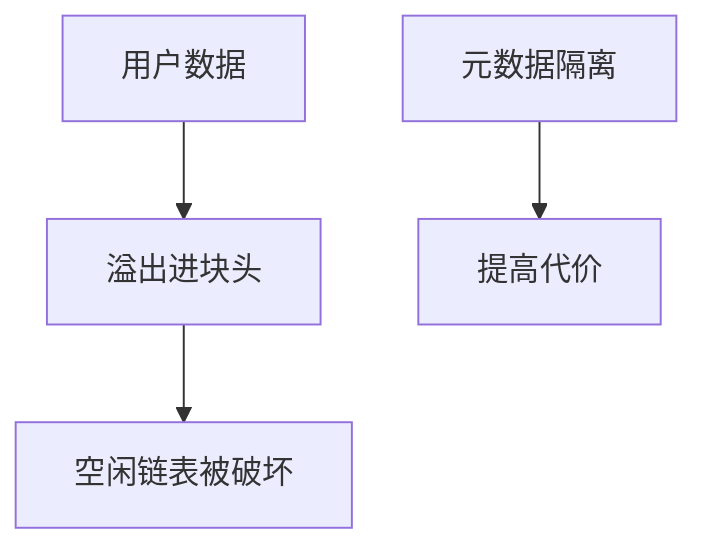

# 分配器攻击

分配器在块头里记账：大小、空闲链表。用户数据溢出进块头，等于让 malloc 按敌手的账本工作。加固分配器把元数据与用户数据隔开、把链表指针加密，仍不是内存安全。

<footer>—— 据 Doug Lea 的分配器叙述；Szekeres SoK；对照 ptmalloc/jemalloc 的加固演进</footer>

## 定位

上一课[UAF](/cs/heap-uaf)已经能串对象。缺口是**分配器元数据**作为额外攻击面。本课讲为何溢出/双重释放会破坏堆契约，以及隔离与校验指针一类防御——不给改链表的操作序列。

后课默认已经读完本课钉下的合同，只补差，不从该领域第一性原理重开。

## 问题

经典 chunk 把 size 与 fd/bk 放在用户数据旁边。溢出改 fd 则空闲链表被劫持——只陈述性质。双重释放让同一块进两次表。缺口是：分配器是 TCB，要校验与隔离。

### 不是「选用某 libc 就结束」

加固提高代价。任意写仍可能。安全语言减少到达分配器的路径。

dlmalloc 叙事是历史对照。今日分配器有 cookie、随机、隔离。本课禁止利用笔记。

## 方法

对照：内联元数据 vs 隔离页。列出防御：canary 式 chunk 校验、unlink 检查、隔离释放。指向 sanitizer 与 fuzzer 后课。

图中节点是本课的机制骨架；课程不把图展开成可运行的攻击步骤。

## 机制

堆完整性是分配器不变量。整数溢出下一课常是「算错长度再交给分配器/复制」的上游。

前提写进合同之后，游戏外的误用只当失败模式点名，不在本课写成操作程序。

## 边界

本课无 unlink 配方。整数溢出漏洞下一课。

## 小结

- UAF 串对象；溢出/双重释放可直接改分配器账本。
- 隔离元数据与校验指针是加固。
- 仍非内存安全。
- 下一课整数溢出。
- 出处：Szekeres et al.；Doug Lea allocator notes；对照 CWE-122/415。
