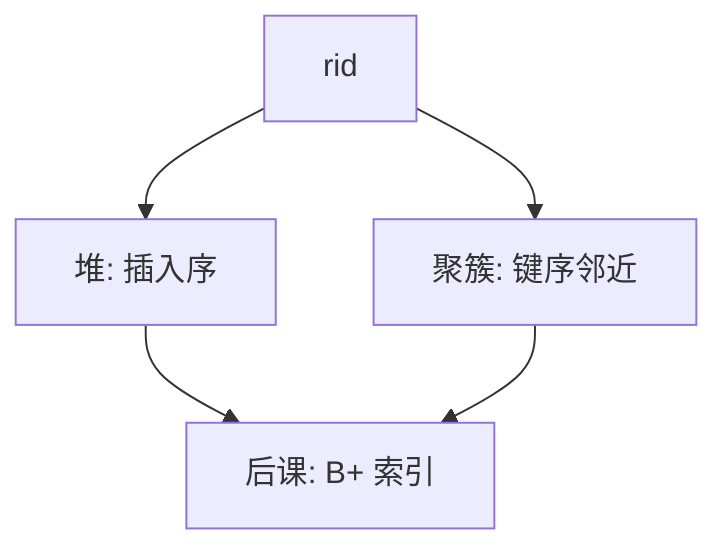

# 堆文件与聚簇

堆按插入摆放；聚簇按键把相邻元组放进相邻页，范围扫描才不必满世界跳。

<footer>—— 据 Ramakrishnan and Gehrke；Gray and Reuter 对文件组织的整理</footer>

[上一课](/cs/page-slot)给出槽化页与 rid。本课不重画页头。缺口是：一堆页如何组成一张表的存储。堆文件几乎只保证「能插入、能扫全表」；聚簇把同一键区间的行放在物理上相近的页里，让范围查询的 I/O 变顺序。

## 问题

全表扫描走堆：顺着页链表或空间图读。点查若只靠堆，只能扫。索引可以拿 rid 回表，但若目标行在磁盘上随机散布，二次 I/O 仍碎。[B 树](/cs/btree-external)已经能按键找；本课问的是**数据页本身怎么排**。聚簇索引（或聚簇堆）让叶上的顺序与页上的顺序一致；堆加二级索引则行序与键序无关。

聚簇是文件组织，不是「多建一棵树」的同义词。一张表通常只有一种聚簇序；其余索引都是非聚簇，必须 rid 回表。

## 方法

堆：空闲空间图找到够放的页，插入占用一个槽，rid 新分配。删除留洞，可填可整理。聚簇：按主键（或指定键）排序装页，插入若页满则分裂或溢页，以保持键的大致邻近。本课不把索引内部结构写完，只区分「数据即叶」与「数据在堆、索引只存键和 rid」。

## 机制

范围查询在聚簇文件上接近顺序预读；在堆上即使有二级索引，也会变成随机 rid 追记录——这正是前几课代价模型里「回表随机 I/O」那一项。插入在堆上便宜，在聚簇上可能触发页分裂，改变已有 rid 或依赖转发。批量装载按键排序一次写成聚簇，比逐条插入少分裂。

多表聚簇（把一对多的行交叉存放）能加速特定连接，但破坏单表扫描的简单图像，主干只点名，不做成默认。

## 边界

本课不讲分区表、列存、HTAP 的双格式。也不把「主键一定聚簇」写成公理：有的引擎堆+二级主键索引。后课 B+ 树默认可以挂在堆上当二级索引，也可以自己当聚簇叶。

TID 扫描（先从索引收集 rid 再按页排序回表）是堆组织上的代价修补，本课只点名：随机 rid 可以排成页序，仍不是聚簇。后课默认：表有一种主文件组织（堆或聚簇）；索引是附加的访问路径。

文件组织一旦选定，查询计划的访问路径才有「扫堆还是走叶序」这一问。本课不改逻辑模式，只改物理邻近。

## 小结
- 批量按键装载比逐条插入少分裂，这是装载路径，不是另一种查询语言。
- 后课 B+ 可以当聚簇叶，也可以当堆上的二级索引。

- 页与槽已在；本课在文件级选择堆或按键聚簇。
- 聚簇加速范围与有序扫描，插入与分裂更贵。
- B+ 树如何当索引头，是后课缺口。
- 出处：Ramakrishnan and Gehrke；Garcia-Molina, Ullman and Widom。
