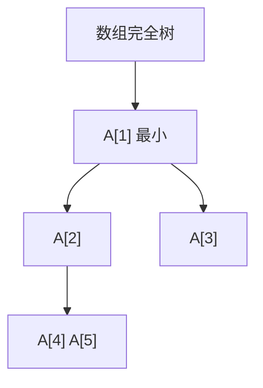

# 堆与优先队列

只要反复取出当前最小，不必维持全部键的中序；完全二叉树里父小于子女，数组下标就能当指针。

<footer>—— 据 Williams, Algorithm 232: Heapsort, CACM 1964；Cormen, Leiserson, Rivest and Stein 整理</footer>

[上一课](/cs/bplus-as-ds)和[红黑树直觉](/cs/rbtree-intuition)把有序字典做到对数。优先队列的合同更窄：insert 与 extract-min（或 max），不要 successor、不要中序遍历。[数组与随机访问](/cs/array-random-access)已经给出下标算术。[摊还分析](/cs/amortized-analysis)不是本课必需——二叉堆单次最坏已是 $\Theta(\log n)$。本课不重讲 B 树分裂。缺口是堆：完全树 + 堆序，用数组表示。

## 问题

用 BST 当优先队列可以，但维护全序浪费。无序数组 extract-min 要扫 $\Theta(n)$。缺口是部分序：**父键 $\le$ 子女键**（最小堆），根即当前最小；形状是完全二叉树，从而高度 $\lfloor\log_2 n\rfloor$，且能塞进数组：$i$ 的子女 $2i,2i+1$。

insert：放末尾上滤。extract-min：用末尾填根再下滤。均为 $\Theta(\log n)$。建堆可以自底向上 $\Theta(n)$，后课堆排序会用。

Williams 1964 的堆排序把这套结构送进排序课。本课只交 ADT。

## 方法

抽象：优先队列。表示：数组 $A[1..n]$（或从 0 偏置）。堆不变式加形状不变式。上滤/下滤交换父与子，直到序恢复。

decrease-key 在 Dijkstra 里需要：沿父走 $\Theta(\log n)$。若没有到数组下标的句柄，找元素会退回 $\Theta(n)$。合同要声明是否提供句柄。

## 机制

堆不支持高效查找任意键，不是字典。与 BST 分工：要序遍历用树；只要最小用堆。二项堆、斐波那契堆把 decrease-key 摊还做得更低，算法课需要时再请；主干先二叉堆。

数组表示吃空间局部性：下滤走的地址仍有一定跳跃（$2i$），比链表好，比顺序扫差。

## 边界

本课不把堆排序证完，不引入 $d$ 叉堆的调参。也不把操作系统的进程就绪队列写成必须用堆——那是调度课的选择。

后课默认：优先队列 = 堆合同，$\Theta(\log n)$ 插入与取端。按任意键 $O(1)$ 期望查找是散列的缺口。

## 小结

- 优先队列不需要全序；堆序 + 完全形状足够。
- 数组下标当父子，insert/extract-min 为 $\Theta(\log n)$。
- 无序键的期望 $O(1)$ 查找靠下一课散列函数。
- 出处：Williams, *CACM*, 1964；Cormen et al. 第 6 章。
