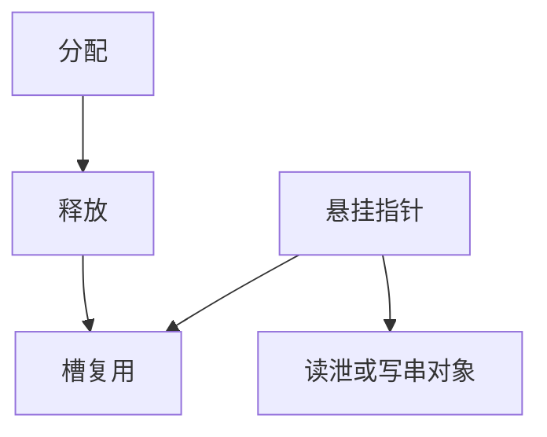

# 堆 UAF

释放后指针仍被解引用，对象槽可能已租给别人。读则泄，写则改别人的对象——包括函数指针。生命周期错误与越界写是两条路，都能到达同一类控制数据。

<footer>—— 据 Szekeres et al., SoK: Eternal War in Memory, Oakland 2013；对照 CWE-416</footer>

## 定位

上一课[JOP](/cs/jop-cop)要函数指针可写。缺口是**堆生命周期**：UAF。本课讲悬挂指针与分配器复用，不给利用堆布局的步骤。

后课默认已经读完本课钉下的合同，只补差，不从该领域第一性原理重开。

## 问题

`free` 后未置空，后续使用碰到新对象。类型若不同，就是混淆的入口。缺口是所有权，不是再讲栈帧。语言与 GC、或 borrow checker，从根上删这类。

### 双重释放

重复 `free` 破坏分配器元数据，下一课专门收。UAF 是「用」；double-free 是「还两次」。

Szekeres SoK。ASan 后课检测。本课禁止构造 UAF 利用。

## 方法

画：分配→释放→槽复用→悬挂指针。防御：置空、隔离释放、延迟复用、内存安全语言。对照 canary：帮不上堆对象内部。

图中节点是本课的机制骨架；课程不把图展开成可运行的攻击步骤。

## 机制

堆把时间轴引进空间安全。下一课分配器自身的元数据：chunk 头被改时，分配器成为原语。

前提写进合同之后，游戏外的误用只当失败模式点名，不在本课写成操作程序。

## 边界

本课无堆风水。分配器攻击下一课仍只讲机制与加固。

## 小结

- 控制数据也可住在堆对象里。
- UAF：释放后用，槽可能已是别人。
- 所有权与安全语言是根治；检测器后课。
- 下一课分配器元数据。
- 出处：Szekeres et al., Oakland 2013；CWE-416。
