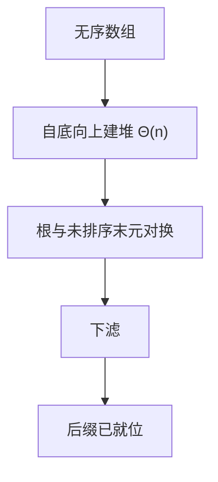

# 堆排序

堆把无序数组收成可反复取出极值的结构；排序就是建堆再反复弹出。

<footer>—— 据 Williams, Algorithm 232: Heapsort, 1964；Floyd, Algorithm 245: Treesort 3, 1964；Knuth, TAOCP vol. 3 整理</footer>

上一课[插入与归并](/cs/insertion-merge)对照了前缀不变式与分治合并：一个最坏平方、一个最坏 $n\log n$ 但要线性缓冲。[堆与优先队列](/cs/insertion-merge)已经能 $O(\log n)$ 取出最大元。本课不重建堆。缺口是：用同一数组上的堆完成就地排序，把「额外线性空间」从 $n\log n$ 比较排序里拿掉。

## 问题

归并的 $\Theta(n\log n)$ 来自分治加线性合并，不是来自堆。若只反复从无序数组找最大再放到末尾，每轮扫描仍是平方。缺口因此不是新的比较模型，而是把已有的堆操作排成：**建堆一次，再把根与未排序后缀的末元对换并下滤**。终止时后缀从大到小填满，整表有序。

本课仍在比较排序里。稳定性默认放弃：相等键在下滤时可以越过彼此。线性时间排序是后课才离开比较模型。

### 建堆不是 $n$ 次插入

从空堆插入 $n$ 个是 $\Theta(n\log n)$。Floyd 自底向上：叶子已是堆，从最后一个非叶往根下滤，总代价 $\Theta(n)$。排序阶段仍是 $n$ 次 $\Theta(\log n)$ 下滤，整体 $\Theta(n\log n)$。不要把建堆也写成 $n\log n$ 再加一遍。

Williams 给出堆排序；Floyd 把建堆收成线性。Knuth vol. 3 把同一数组既当堆又当输出区。优先队列课已有下滤，本课只排工序。

## 方法

数组下标堆：父 $i$ 的子为 $2i$、$2i+1$（或 $0$ 基等价）。建堆后不变式：下标 $1..i$ 是堆， $i+1..n$ 是已就位的后缀且不小于堆中任何键。每轮：交换 $A[1]$ 与 $A[i]$， $i\leftarrow i-1$，对根下滤。

正确性走[循环不变式](/cs/loop-invariant)：后缀有序且是全局最大的那些键。代价：建堆线性，排序阶段 $\Theta(n\log n)$。

## 机制

就地：只占 $O(1)$ 额外字（递归下滤可改成循环）。与归并对照：最坏同样 $n\log n$，空间从 $\Theta(n)$ 降到常数，缓存上连续下滤与归并的顺序扫描不同，本课不量化。[局部性](/cs/locality-principle)只提醒：堆不是顺序扫描。

下滤破坏稳定性。若要稳定的 $n\log n$ 就地，本课不提供；那不是堆的职责。

## 边界

本课不引入快排分区，不证比较下界。键不是数轴上的计数对象。图算法里的优先队列仍用堆，但那是松弛不是排序——[Dijkstra](/cs/dijkstra)才接。

后课默认：堆排序 = 线性建堆 + $n$ 次下滤，最坏 $\Theta(n\log n)$，就地、不稳定。期望线性的分区是下一课的缺口。

## 小结

- 堆排序把优先队列变成就地比较排序，最坏 $n\log n$。
- 建堆 $\Theta(n)$；不要写成 $n$ 次插入。
- 默认不稳定；额外空间常数。
- 出处：Williams, 1964；Floyd, 1964；Knuth, TAOCP vol. 3；CLRS 第 6 章。
