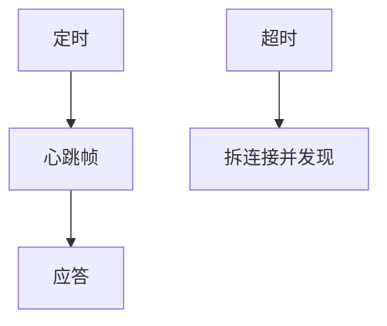

# 心跳与超时

空闲连接与半开要用主动心跳在应用层刷新；超时值要大于 RTT 与短暂拥塞，小于用户可忍受的失败检测。

<footer>—— 据 RFC 1122 对照；gRPC keepalive；WebSocket ping 整理</footer>

[TCP keepalive](/cs/keepalive-half-open) 太慢。[成帧](/cs/message-framing) 已能发小消息。[上一课](/cs/message-framing) 留下存活检测。缺口是**应用心跳**：间隔、超时、与 RTO 叠。本课不把重试写完。

## 问题

反向代理、NAT、Maglev 都可能静默丢空闲。应用 ping/pong：间隔 15–60 s 常见，远短于 TCP keepalive。超时：连续未应答则拆，触发发现换后端。与 NTP 无关。无线调度抖动要给余量，否则假死。SSE 用注释行当心跳。QUIC PING 帧。过频心跳在万连接上成 C10K 负载。

不要把心跳当业务数据。

间隔无唯一 RFC。本课钉原则。

### 值在 RTT 与 NAT 之间

太短杀卫星会话，太长留半开。心跳也是 C10K 负载。三层心跳要错开防同步。不是业务数据。

## 方法

对照：传输 keepalive / 应用心跳 / LB 健康检查。画：定时发 → 等 pong → 失败则关。与 ICE 刷新一致。

方法止于选定对象与对照；机制才说它如何嵌入已有分层与主干课。

## 机制

超时 $\lt$ 2×RTT 会在卫星上误杀。超时 >> NAT 会话则半开。与 ABR 无关。服务发现心跳是控制面，连接心跳是数据面会话。

安全：无认证的心跳可被用来保活攻击连接表，要绑会话。

## 边界

本课不引入指数退避的全部（下一课重试）。重试与幂等是下一课。后课默认：应用心跳检测会话死活；值按 RTT 与 NAT 定。

三层心跳（TCP、HTTP、业务）要错开，避免同步风暴。

上一课留下的缺口在本课收口；「心跳与超时」进入后课词汇表后只引用。文献用来钉对象与边界，不把本课写成该主题的独立综述。下一课[重试与幂等](/cs/retry-idempotency)。

## 小结

- 应用心跳补 NAT 与代理空闲策略。
- 超时在 RTT 与用户等待之间。
- 规模上心跳也是负载。
- 后课只引用本课钉死的对象，不从该领域总问题重开。
- 出处：RFC 1122 对照；应用实践。
