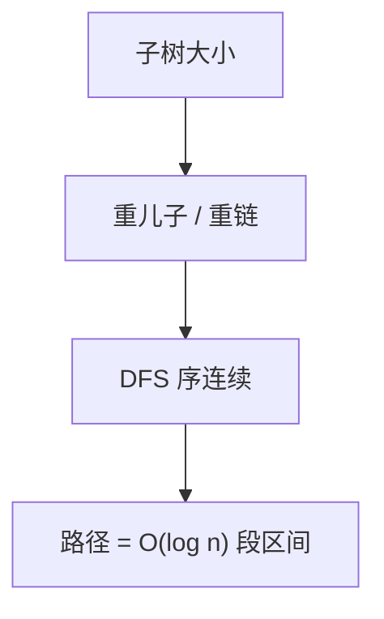

# 重链剖分

每条根到叶路径切成 $O(\log n)$ 条重链；链内 DFS 序连续，路径查询变成序列上 $O(\log n)$ 段区间。

<footer>—— 据 Sleator and Tarjan, A Data Structure for Dynamic Trees, 1983 的重边思想；竞赛与教材中的 heavy-light decomposition 整理</footer>

上一课[树上倍增与差分](/cs/tree-binary-lifting)处理静态路径和与离线加。线段树、树状数组活在序列上。缺口是把**树上路径**映成序列区间：重链剖分（HLD）。不重写倍增表。本课静态树 + 序列结构；动态换边是 Link-Cut，只点名。

## 问题

子树大小 $sz[u]$。对每个 $u$，重儿子是 $sz$ 最大的孩子，边 $(u,\mathrm{son}[u])$ 为重边；其余轻边。重边串成重链，链顶 `top[u]`。性质：任意点到根，轻边次数 $O(\log n)$——每次轻边走到的子树至少减半。故任意路径 $u$–$v$ 可拆成 $O(\log n)$ 条链上的连续段。

DFS 先走重儿子，则每条重链在 DFS 序里是连续区间。路径查询：当 `top[u]\neq top[v]`，把更深链顶的那一段交给序列结构，再跳到 `parent[top]`。最后同一链上一段。

缺口是剖分，不是再发明线段树。

### 重链不是直径

重边按子树大小，不是边权。直径、最长链是另一回事。Sleator–Tarjan 的动态树用「偏爱边」保持类似重轻，本课静态剖分即可。

HLD 把树路径摊成区间，与 ST 表/线段树对接。Sleator–Tarjan 1983 的 Link-Cut 用 splay 维护优选路径，本课不实现。后课点分治按重心递归，不是按链。

## 方法

两遍 DFS：第一遍 $sz$ 与重儿子；第二遍链顶与 DFS 序。路径/子树查询：子树是 DFS 序一段；路径如上跳链。修改同步打到序列结构。

复杂度：剖分 $O(n)$；每次路径 $O(\log n)$ 段乘以序列结构的区间代价（常再 $\log n$）。

## 机制

轻边使 $sz$ 减半，故一条根路径上轻边 $O(\log n)$，链段数同阶。与倍增比：倍增段数也是 $O(\log n)$ 但每段是 $2^k$ 祖先跳跃，难接任意区间结构；HLD 的段是真实树边连续，能打懒惰标记。子树修改直接 DFS 序区间，不必走轻边论证。

不要把「每次跳 `top`」写成 $O(n)$：链顶跳跃沿轻边，次数对数。

## 边界

本课不写 LCT、不写欧拉旅游树。点分治处理「过某点的路径统计」，与 HLD 的「路径是区间」不同。后课默认：树上路径可剖成对数段序列区间。下一课用重心把距离类统计变成分治。

## 小结

- 重儿子使轻边减半；路径 $O(\log n)$ 条链。
- 链在 DFS 序连续，接线段树。
- 静态剖分；动态树另论。
- 出处：重轻思想见 Sleator and Tarjan, 1983；剖分实现为标准教材技法。
