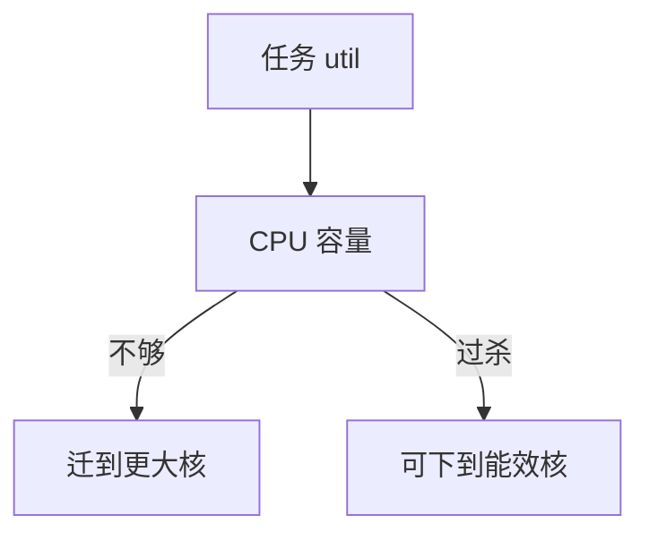

# 异构核调度

big.LITTLE / 混合核把高容量核与高能效核放在同一系统：调度器要按任务 util 与容量把人放到「够用且更省」的那边。

<footer>—— 据 ARM big.LITTLE 软件说明；Linux 对 asymmetric CPU capacity 的文档</footer>

[EAS](/cs/eas-scheduling) 的模型在异构上才真正分化。[调度域](/cs/sched-domains) 会出现不同 `cpu_capacity`。缺口是 **非对称容量**：不是再讲 SMT。

## 问题

小核容量 400、大核 1024（相对值）。把重任务放小核会拖尾；把永远睡的放小核省电。缺口：misfit 迁移（任务 util 超过本核容量则上迁）；用户 cpuset 可能只留小核；与 [THP](/cs/thp) 无关。本课不把 Intel 的 E-core 品牌当目录。

中间层核（mid）使策略更碎。容量随频率变，EAS 同时看 freq。

## 方法

wake：过滤容量不足的 CPU。idle load balance：把 misfit 拉到大核。对照 [RSS](/cs/rss-multiqueue)：硬件哈希不管任务轻重；这里必须看 util。对照 [blkio](/cs/blkio-cgroup)：I/O 权重不改变 CPU 容量。

## 机制

异构调度把单 ISA 多微架构收成容量数字，使手机能在续航与跟手之间折中。错误的容量表等于永久 misfit 或永远大核。不要写成购买指南。与实时：RT 任务常钉大核，后课 deadline。

调试：看 `cpu_capacity` 与任务 `util_avg`。

实现上：misfit 是「util 超过本 CPU 容量」，不是 nice。小核跑满的轻任务不应上迁。cluster 迁移迟滞避免在大小核间抖。 读法上只引用[上一课](/cs/eas-scheduling)的结论，不把对象换成训练推理或限价簿。

本课在操作系统进阶的「调度进阶 / 公平、实时与能耗」课序里，对象是 **异构核调度**。

- 先修只引用，不重导：上一课的结论当公理，本课只补差。
- 五栏不吞并：不把本课写成大模型训练/推理，也不写成限价簿或权重量化。
- 文献用 OSTEP、McKusick、内核文档与具名会议论文；不发明 arXiv 编号。

## 边界

本课不引入 cluster 迁移的全部迟滞参数。不保证虚拟机把异构暴露给客户。下一课硬时限：SCHED_DEADLINE。

版本字段会变，课序钉的是机制对象「异构核调度」，不是某一主线内核的结构体名。
后课默认：任务可按容量在大小核间迁移。CPU 带宽与截止时间调度类，下一课。

## 小结

- 异构核用容量数字决定上下迁。
- misfit 防止重任务卡在小核。
- SCHED_DEADLINE 是下一课。
- 出处：Linux asymmetric capacity；ARM big.LITTLE。
